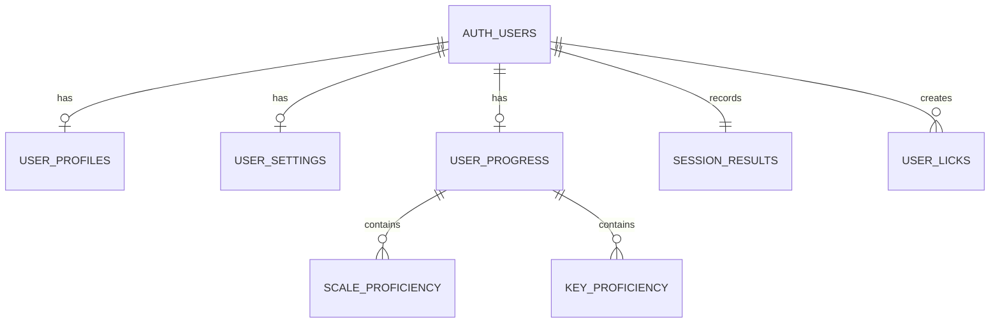
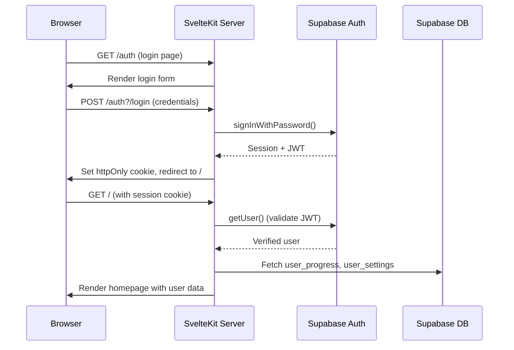

# Technical Specification

# 0. Agent Action Plan

## 0.1 Intent Clarification

### 0.1.1 Core Feature Objective

Based on the prompt, the Blitzy platform understands that the new feature requirement is to **transform Mankunku from a zero-backend, single-device, client-only Progressive Web Application into a multi-user, authenticated application with server-side persistence and cross-device progress synchronization**. The application currently stores all data in browser `localStorage` (prefixed `mankunku:`) and `IndexedDB` (`mankunku-audio`), which means each device maintains its own independent data store with no cross-device visibility.

The user's requirements decompose into the following concrete objectives:

- **Multi-User Support**: Introduce user identity so that multiple distinct users can use the same application instance without data collision. Currently, the app is single-anonymous-user-per-device by design (ADR-001 in `documentation/architecture/overview.md`).
- **Authentication**: Add a login/registration system so users can authenticate their identity. The current codebase has zero authentication infrastructure — no `+server.ts` files, no `hooks.server.ts`, no auth libraries, and the `src/app.d.ts` App namespace is entirely empty.
- **Backend Database**: Replace or augment the current browser-only persistence layer (`src/lib/persistence/storage.ts`, `src/lib/persistence/audio-store.ts`, `src/lib/persistence/user-licks.ts`) with a server-side database so user data survives device changes.
- **Cross-Device Progress Resumption**: Ensure a user can log in from any device and resume practice from their current progress level. This means the `UserProgress` object (sessions, adaptive state, scale/key proficiency, streaks, XP), `Settings`, `UserLicks`, and audio recordings must be available across devices.

Implicit requirements detected:

- **SvelteKit Server-Side Rendering (SSR) Activation**: The application currently deploys as static files via `adapter-auto`. Authentication requires server-side hooks (`hooks.server.ts`), server load functions (`+layout.server.ts`), and cookie-based session management, necessitating an SSR-capable adapter.
- **Database Schema Design**: The existing `UserProgress`, `Settings`, `SessionResult`, and `Phrase` TypeScript interfaces must be mapped to relational database tables.
- **Row-Level Security**: Since multiple users will share the same database, each user's data must be isolated and protected.
- **Data Migration Strategy**: Existing localStorage data from anonymous users should have a path to be associated with a newly created account.
- **Auth-Aware UI Gating**: The root layout (`src/routes/+layout.svelte`) and individual route pages must conditionally show login/logout controls and protect authenticated-only features.
- **Offline Fallback**: The PWA offline capability should be preserved where possible, with local-first writes that sync to the server when connectivity is available.

### 0.1.2 Special Instructions and Constraints

- **No explicit design system specified**: The application uses Tailwind CSS v4.2.2 with custom CSS variables defined in `src/app.css`. UI additions must follow existing patterns.
- **Maintain backward compatibility**: The existing audio pipeline (`src/lib/audio/`), scoring engine (`src/lib/scoring/`), music theory layer (`src/lib/music/`), and content system (`src/lib/data/`, `src/lib/phrases/`) must remain unchanged. Only the persistence, state, routing, and infrastructure layers are affected.
- **Follow existing repository conventions**: Svelte 5 runes mode (`$state`, `$derived`, `$props()`), TypeScript strict mode, `$lib/` alias pattern, and modular domain-folder organization.
- **Preserve PWA capability**: The `@vite-pwa/sveltekit` integration with Workbox caching must continue to function for offline practice sessions.

### 0.1.3 Technical Interpretation

These feature requirements translate to the following technical implementation strategy:

- To **support multiple users**, we will integrate Supabase as the backend platform, providing managed PostgreSQL, built-in authentication, Row Level Security, and storage — all accessible via the `@supabase/supabase-js` client library and `@supabase/ssr` package for SvelteKit server-side auth.
- To **implement authentication**, we will create `src/hooks.server.ts` for server-side session management, new auth routes under `src/routes/auth/` for login, registration, and OAuth callback handling, and modify the root layout to display auth state.
- To **add a backend database**, we will design PostgreSQL tables mirroring the existing TypeScript interfaces (`UserProgress`, `Settings`, `SessionResult`, user licks) and create a new `src/lib/supabase/` module with server and browser client factories.
- To **enable cross-device progress resumption**, we will modify the state management layer (`src/lib/state/progress.svelte.ts`, `src/lib/state/settings.svelte.ts`) to read from and write to the Supabase database instead of (or in addition to) `localStorage`, and migrate audio recording storage from browser IndexedDB to Supabase Storage buckets.

## 0.2 Repository Scope Discovery

### 0.2.1 Comprehensive File Analysis

The repository is structured as a single-package SvelteKit application with the following file inventory. Every file listed has been inspected via `read_file` or `get_source_folder_contents` to determine its relevance to this feature addition.

**Existing Files Requiring Modification**

| File Path | Current Purpose | Required Modification |
|---|---|---|
| `src/app.d.ts` | Empty SvelteKit App namespace scaffold | Add `App.Locals` with `supabase` client and `safeGetSession` helper; define `PageData` with session/user |
| `src/routes/+layout.svelte` | Root layout with 7-item nav, theme application, onboarding gate | Add auth-aware header (login/logout/user display), inject session from layout data, conditionally show navigation |
| `src/routes/+page.svelte` | Homepage with stats, CTA, session list, nav grid | Gate stats display behind auth; show login prompt for unauthenticated visitors |
| `src/routes/progress/+page.svelte` | Progress dashboard with charts, session history, reset | Source data from server-loaded user progress instead of client-only store |
| `src/routes/settings/+page.svelte` | Settings page (instrument, theme, tonality, audio, reset) | Persist settings changes to Supabase; load from server on initial visit |
| `src/routes/record/+page.svelte` | Lick recording page using capture/pitch/onset modules | Save recorded licks to Supabase `user_licks` table and audio to Supabase Storage |
| `src/routes/library/+page.svelte` | Lick browser with filtering | Include user-recorded licks from Supabase alongside curated licks |
| `src/routes/library/[id]/+page.svelte` | Individual lick detail/practice view | Support user-owned lick detail from Supabase |
| `src/routes/practice/+page.svelte` | Live call-and-response practice loop | Record session results to Supabase after scoring |
| `src/routes/practice/settings/+page.svelte` | Session configuration (key, difficulty, category) | No direct changes needed (reads from state stores) |
| `src/routes/scales/+page.svelte` | Scale reference browser | No direct changes needed (static content) |
| `src/lib/persistence/storage.ts` | localStorage wrapper with `mankunku:` prefix | Add dual-write layer: write to localStorage for cache AND queue sync to Supabase |
| `src/lib/persistence/user-licks.ts` | CRUD for user-recorded licks in localStorage | Replace localStorage backend with Supabase `user_licks` table; maintain local cache |
| `src/lib/persistence/audio-store.ts` | IndexedDB storage for audio blobs (max 20 recordings) | Add upload-to-Supabase-Storage on save; download from Storage on cross-device access |
| `src/lib/state/progress.svelte.ts` | Progress state store with `$state<UserProgress>`, migration logic, 200-session cap | Add Supabase sync: load from DB on auth, write to DB on mutation, retain local fallback |
| `src/lib/state/settings.svelte.ts` | Settings state store with defaults, theme application | Add Supabase sync: load user settings from DB on auth, persist changes to DB |
| `src/lib/components/onboarding/Onboarding.svelte` | First-run onboarding wizard | Add option to skip onboarding if user has existing cloud data from another device |
| `package.json` | Project manifest with dependencies | Add `@supabase/supabase-js`, `@supabase/ssr`; add adapter-node or adapter-vercel |
| `svelte.config.js` | SvelteKit config with `adapter-auto`, runes enabled | Switch to SSR-capable adapter (`adapter-node` or `adapter-vercel`) |
| `vite.config.ts` | Vite config with Tailwind, SvelteKit, PWA plugin, Vitest | Adjust PWA config for auth routes; ensure API routes are not cached by service worker |
| `tsconfig.json` | TypeScript config extending `.svelte-kit/tsconfig.json` | No changes needed (strict mode already enabled) |

**New Source Files to Create**

| File Path | Purpose |
|---|---|
| `src/hooks.server.ts` | SvelteKit server hook: creates per-request Supabase server client, attaches to `event.locals`, validates session cookies |
| `src/lib/supabase/client.ts` | Browser-side Supabase client factory using `createBrowserClient` from `@supabase/ssr` |
| `src/lib/supabase/server.ts` | Server-side Supabase client factory using `createServerClient` from `@supabase/ssr` |
| `src/lib/supabase/types.ts` | Generated TypeScript types for the Supabase database schema (via `supabase gen types`) |
| `src/routes/+layout.server.ts` | Server-side layout load function: retrieves session via `event.locals.safeGetSession()`, passes to client |
| `src/routes/+layout.ts` | Client-side layout load: creates browser Supabase client, exposes `supabase` and `session` to all routes |
| `src/routes/auth/+page.svelte` | Login/registration page with email/password form and OAuth buttons |
| `src/routes/auth/+page.server.ts` | Server-side form actions for login, register, and OAuth initiation |
| `src/routes/auth/callback/+server.ts` | OAuth callback endpoint to exchange auth code for session |
| `src/routes/auth/logout/+server.ts` | Logout endpoint: signs out via Supabase, clears session cookies, redirects |
| `src/lib/persistence/sync.ts` | Sync orchestrator: handles bidirectional sync between localStorage cache and Supabase DB |
| `src/lib/types/auth.ts` | TypeScript types for auth-related interfaces (UserProfile, AuthState) |
| `supabase/migrations/00001_create_users_profile.sql` | SQL migration: `user_profiles` table with display name, instrument, preferences |
| `supabase/migrations/00002_create_user_progress.sql` | SQL migration: `user_progress`, `session_results`, `scale_proficiency`, `key_proficiency` tables |
| `supabase/migrations/00003_create_user_settings.sql` | SQL migration: `user_settings` table mirroring the Settings interface |
| `supabase/migrations/00004_create_user_licks.sql` | SQL migration: `user_licks` table for user-recorded phrases |
| `supabase/migrations/00005_enable_rls.sql` | SQL migration: Row Level Security policies on all user-scoped tables |
| `.env.example` | Template for required environment variables (`PUBLIC_SUPABASE_URL`, `PUBLIC_SUPABASE_ANON_KEY`) |
| `tests/unit/auth/auth-flow.test.ts` | Unit tests for auth flow logic and session handling |
| `tests/unit/persistence/sync.test.ts` | Unit tests for the sync orchestrator module |

**New Test Files to Create**

| File Path | Coverage Target |
|---|---|
| `tests/unit/auth/auth-flow.test.ts` | Auth state management, session validation, login/logout flows |
| `tests/unit/persistence/sync.test.ts` | Sync orchestrator: conflict resolution, offline queueing, merge logic |
| `tests/unit/persistence/supabase-storage.test.ts` | Supabase Storage integration for audio blob upload/download |
| `tests/integration/auth-routes.test.ts` | End-to-end auth route testing (login, register, callback, logout) |

### 0.2.2 Integration Point Discovery

- **API Endpoints**: Currently zero `+server.ts` files exist. New endpoints needed at `src/routes/auth/callback/+server.ts` and `src/routes/auth/logout/+server.ts`.
- **Database Models**: No database exists today. New PostgreSQL tables will mirror: `UserProgress` (from `src/lib/types/progress.ts`), `Settings` (from `src/lib/state/settings.svelte.ts`), `Phrase` for user licks (from `src/lib/types/music.ts`), and `SessionResult` (from `src/lib/types/progress.ts`).
- **Service/State Layer**: Four state stores exist in `src/lib/state/` — `progress.svelte.ts` and `settings.svelte.ts` require Supabase integration; `session.svelte.ts` and `library.svelte.ts` remain client-transient.
- **Persistence Layer**: All three files in `src/lib/persistence/` (`storage.ts`, `user-licks.ts`, `audio-store.ts`) require modification to support dual-write with Supabase.
- **Middleware/Hooks**: No `hooks.server.ts` exists. This file is the central integration point for Supabase auth cookie management.
- **Layout Chain**: The single `+layout.svelte` must be augmented with `+layout.server.ts` and `+layout.ts` to propagate session data to all routes.

### 0.2.3 Web Search Research Conducted

- **SvelteKit authentication patterns**: The official SvelteKit docs recommend session-based auth via `hooks.server.ts` and server load functions. Auth.js (`@auth/sveltekit`) and Supabase are the two leading solutions for SvelteKit 2.
- **Supabase SSR integration**: The `@supabase/ssr` package (v0.9.0) replaces the deprecated `@supabase/auth-helpers-*` packages and provides `createServerClient` and `createBrowserClient` factories for cookie-based session management.
- **Cross-device data sync patterns**: Best practice is local-first writes with background sync to the server, using optimistic updates and conflict resolution based on timestamps.
- **Security considerations**: Supabase Row Level Security (RLS) ensures each user can only access their own data. `getUser()` must be called to validate JWTs server-side — `getSession()` alone reads from cookies without verification.

## 0.3 Dependency Inventory

### 0.3.1 Private and Public Packages

All existing dependencies remain unchanged. The following table lists the new packages required for this feature addition alongside key existing packages that interact with the new infrastructure.

**New Dependencies (to add)**

| Registry | Package Name | Version | Purpose |
|---|---|---|---|
| npm | `@supabase/supabase-js` | `^2.99.3` | Isomorphic Supabase client for database queries, auth, and storage |
| npm | `@supabase/ssr` | `^0.9.0` | SvelteKit SSR integration: `createServerClient` and `createBrowserClient` for cookie-based auth |
| npm | `@sveltejs/adapter-node` | `^5.2.0` | Node.js SSR adapter replacing `adapter-auto` for server-side auth hooks (alternative: `@sveltejs/adapter-vercel` for Vercel deployment) |

**Existing Dependencies (unchanged, for reference)**

| Registry | Package Name | Version | Relevance to Feature |
|---|---|---|---|
| npm | `@sveltejs/kit` | `^2.21.1` | SvelteKit framework — provides hooks, load functions, routing infrastructure |
| npm | `svelte` | `^5.33.0` | Svelte 5 with runes mode — all state stores use `$state` |
| npm | `@sveltejs/adapter-auto` | `^6.0.0` | Current adapter — to be replaced by `@sveltejs/adapter-node` |
| npm | `vite` | `^7.3.0` | Build tool — environment variable handling for Supabase keys |
| npm | `@vite-pwa/sveltekit` | `^0.7.3` | PWA plugin — service worker config needs auth route exclusions |
| npm | `tailwindcss` | `^4.2.2` | Styling — auth UI components will use existing Tailwind utilities |
| npm | `vitest` | `^4.1.0` | Test runner — new test files for auth and sync modules |
| npm | `typescript` | `~5.9.0` | Type system — new Supabase database types will integrate |
| npm | `tone` | `^15.1.22` | Audio synthesis — unchanged, no auth interaction |
| npm | `pitchy` | `^4.1.1` | Pitch detection — unchanged, no auth interaction |
| npm | `smplr` | `^1.4.0` | SoundFont playback — unchanged, no auth interaction |
| npm | `abcjs` | `^6.4.4` | Notation rendering — unchanged, no auth interaction |

### 0.3.2 Dependency Updates

**Import Updates**

Files requiring new imports for Supabase integration:

- `src/hooks.server.ts` (new file) — `import { createServerClient } from '@supabase/ssr'`
- `src/routes/+layout.server.ts` (new file) — `import type { LayoutServerLoad } from './$types'`
- `src/routes/+layout.ts` (new file) — `import { createBrowserClient } from '@supabase/ssr'`
- `src/lib/supabase/server.ts` (new file) — `import { createServerClient } from '@supabase/ssr'`
- `src/lib/supabase/client.ts` (new file) — `import { createBrowserClient } from '@supabase/ssr'`
- `src/lib/persistence/sync.ts` (new file) — `import type { SupabaseClient } from '@supabase/supabase-js'`
- `src/lib/state/progress.svelte.ts` — Add import for sync module
- `src/lib/state/settings.svelte.ts` — Add import for sync module
- `src/lib/persistence/user-licks.ts` — Add import for Supabase client
- `src/lib/persistence/audio-store.ts` — Add import for Supabase storage

**External Reference Updates**

- `package.json` — Add `@supabase/supabase-js`, `@supabase/ssr`, `@sveltejs/adapter-node` to `dependencies`/`devDependencies`; remove `@sveltejs/adapter-auto`
- `svelte.config.js` — Change adapter import from `@sveltejs/adapter-auto` to `@sveltejs/adapter-node`
- `.env.example` (new) — Document `PUBLIC_SUPABASE_URL` and `PUBLIC_SUPABASE_ANON_KEY` environment variables
- `vite.config.ts` — Update PWA navigateFallbackDenylist to exclude `/auth/**` routes from service worker caching
- `README.md` — Document Supabase project setup, environment variable configuration, and authentication features

## 0.4 Integration Analysis

### 0.4.1 Existing Code Touchpoints

**Direct Modifications Required**

- **`src/app.d.ts`**: Populate the empty `App` namespace to declare `Locals` (holding the Supabase server client and `safeGetSession` helper), `PageData` (with `session` and `user` objects), and `Error` types. This is the type-level contract that enables all server-side auth integration.

- **`src/routes/+layout.svelte`**: Currently renders a static 7-item navigation bar with an onboarding gate. Must be modified to:
  - Accept `data` prop containing `session`, `supabase`, and `user` from the new layout load chain
  - Conditionally render login/logout controls in the header area
  - Pass `supabase` client to child components via Svelte context or props
  - Subscribe to Supabase `onAuthStateChange` events to reactively update UI on sign-in/sign-out

- **`src/routes/+page.svelte`**: The homepage imports from `src/lib/state/progress.svelte.ts` to display stats (session count, streak, proficiency). Must be updated to show a login prompt for unauthenticated visitors and load stats from server data when authenticated.

- **`src/lib/persistence/storage.ts`**: The `save<T>` and `load<T>` functions currently write/read to `localStorage` with the `mankunku:` prefix. A dual-write layer must be introduced so that writes go to both `localStorage` (for instant offline access) and a sync queue (for eventual server persistence).

- **`src/lib/persistence/user-licks.ts`**: Currently calls `save(STORAGE_KEY, licks)` and `load<Phrase[]>(STORAGE_KEY)` against localStorage. The `saveUserLick`, `deleteUserLick`, and `getUserLicks` functions must be augmented to perform CRUD operations against the Supabase `user_licks` table for authenticated users, while preserving localStorage fallback for offline/anonymous use.

- **`src/lib/persistence/audio-store.ts`**: The `saveRecording` function stores audio blobs in IndexedDB with a 20-recording cap. A parallel upload to Supabase Storage must be added so recordings are accessible cross-device. The `getRecording` function must check Supabase Storage if the blob is not found locally.

- **`src/lib/state/progress.svelte.ts`**: This 268-line module manages the entire user progress lifecycle. Key integration points:
  - `loadProgress()` (line ~15): Currently reads from localStorage — must also fetch from Supabase on authenticated sessions
  - `recordAttempt()` (line ~88): Currently saves to localStorage after recording a session result — must also write to Supabase
  - `resetProgress()` (line ~250): Currently clears localStorage — must also clear server-side data
  - Migration logic (lines ~30-60): The forward-compatible merge and session replay logic must be adapted to handle cloud-to-local merges

- **`src/lib/state/settings.svelte.ts`**: The `saveSettings()` function persists to localStorage. Must additionally persist to Supabase `user_settings` table. The initial load must prefer server data over local data when a session exists.

- **`src/lib/components/onboarding/Onboarding.svelte`**: Must detect whether the authenticated user already has cloud progress data (e.g., from another device) and offer to skip onboarding, or merge existing data.

**Adapter and Build Infrastructure**

- **`svelte.config.js`**: The current `adapter-auto` adapter will resolve to a static adapter in the absence of a detected platform. Since auth requires server-side processing, the adapter must be changed to `adapter-node` (for self-hosted/Docker deployment) or `adapter-vercel`/`adapter-netlify` (for managed platforms).

- **`vite.config.ts`**: The `SvelteKitPWA` plugin currently caches all navigations via `navigateFallback`. Auth-related routes (`/auth/**`) must be excluded from service worker caching to prevent stale session redirects. The Workbox `runtimeCaching` strategy for API calls needs a NetworkFirst policy for Supabase requests.

### 0.4.2 Database/Schema Updates

No database currently exists — the application is entirely client-side. The following PostgreSQL tables must be created in Supabase, using the `auth.users` table (provided by Supabase Auth) as the identity source.

- **`user_profiles`** — Extends `auth.users` with app-specific fields: `display_name`, `avatar_url`, `created_at`, `updated_at`. Linked by `user_id` referencing `auth.users.id`.
- **`user_settings`** — Mirrors the `Settings` interface: `instrument_id`, `default_tempo`, `master_volume`, `metronome_enabled`, `swing`, `theme`, `onboarding_complete`, `tonality_override`. One row per user.
- **`user_progress`** — Stores aggregate progress: `adaptive_state` (JSONB), `total_practice_time`, `streak_days`, `last_practice_date`, `category_progress` (JSONB), `key_progress` (JSONB). One row per user.
- **`session_results`** — Stores individual practice session outcomes: `phrase_id`, `score` (JSONB), `tempo`, `key`, `timestamp`. Capped at 200 per user (matching existing `MAX_SESSIONS`).
- **`scale_proficiency`** — Per-scale proficiency scores per user: `scale_id`, `scores` (integer array), `average`.
- **`key_proficiency`** — Per-key proficiency scores per user: `key` (PitchClass), `scores` (integer array), `average`.
- **`user_licks`** — User-recorded phrases: `name`, `key`, `notes` (JSONB), `harmony` (JSONB), `difficulty` (JSONB), `tags`, `source`, `category`, `audio_url`.
- **Supabase Storage bucket `recordings`** — Audio blob storage for user recordings, replacing IndexedDB for cross-device access.

### 0.4.3 Auth Flow Sequence

## 0.5 Technical Implementation

### 0.5.1 File-by-File Execution Plan

Every file listed below MUST be created or modified. Files are organized into logical groups reflecting the implementation dependency chain.

**Group 1 — Supabase Infrastructure (Foundation)**

- **CREATE `src/lib/supabase/client.ts`** — Browser-side Supabase client factory. Exports a `createClient()` function using `createBrowserClient` from `@supabase/ssr` with the public Supabase URL and anon key from environment variables.
- **CREATE `src/lib/supabase/server.ts`** — Server-side Supabase client factory. Exports a factory function accepting `event.cookies` to create a `createServerClient` instance with cookie get/set handlers.
- **CREATE `src/lib/supabase/types.ts`** — TypeScript database schema types. Defines `Database` type with table definitions for `user_profiles`, `user_settings`, `user_progress`, `session_results`, `scale_proficiency`, `key_proficiency`, `user_licks`.
- **CREATE `.env.example`** — Environment variable template documenting `PUBLIC_SUPABASE_URL` and `PUBLIC_SUPABASE_ANON_KEY`.

**Group 2 — SvelteKit Server Integration (Auth Backbone)**

- **CREATE `src/hooks.server.ts`** — Central server hook. Uses `createServerClient` to create a per-request Supabase client, attaches it to `event.locals.supabase`, implements `safeGetSession()` that calls `getUser()` for JWT validation, and guards protected routes.
- **MODIFY `src/app.d.ts`** — Add typed declarations for `App.Locals` (supabase client, safeGetSession), `App.PageData` (session, user), and `App.Error`.
- **CREATE `src/routes/+layout.server.ts`** — Server-side layout load. Calls `event.locals.safeGetSession()` to retrieve and pass the session to the client layout.
- **CREATE `src/routes/+layout.ts`** — Client-side layout load. Creates a browser Supabase client using `createBrowserClient`, exposes `supabase` and `session` to all child routes via returned data.
- **MODIFY `src/routes/+layout.svelte`** — Accept session/supabase from layout data. Add a header bar with user avatar/name and logout button when authenticated, or a login link when not. Subscribe to `onAuthStateChange` for reactive session updates. Keep existing navigation and onboarding logic.

**Group 3 — Auth Routes (User-Facing Authentication)**

- **CREATE `src/routes/auth/+page.svelte`** — Login and registration page. Dual-mode form with email/password fields, toggle between "Sign In" and "Sign Up" modes, and OAuth provider buttons (Google). Styled with existing Tailwind patterns from `src/app.css`.
- **CREATE `src/routes/auth/+page.server.ts`** — Server-side form actions. Implements `login` action (calls `supabase.auth.signInWithPassword`), `register` action (calls `supabase.auth.signUp`), and `oauth` action (calls `supabase.auth.signInWithOAuth`). Returns `fail()` on errors, `redirect()` on success.
- **CREATE `src/routes/auth/callback/+server.ts`** — OAuth callback handler. Exchanges the `code` query parameter for a session using `supabase.auth.exchangeCodeForSession()`, then redirects to the homepage.
- **CREATE `src/routes/auth/logout/+server.ts`** — Logout handler. Calls `supabase.auth.signOut()`, clears session cookies, and redirects to `/auth`.

**Group 4 — Database Schema (PostgreSQL via Supabase)**

- **CREATE `supabase/migrations/00001_create_users_profile.sql`** — Creates `public.user_profiles` table with columns: `id` (UUID PK, references `auth.users`), `display_name`, `avatar_url`, `created_at`, `updated_at`. Includes trigger to auto-create profile on user signup.
- **CREATE `supabase/migrations/00002_create_user_progress.sql`** — Creates `public.user_progress` table (one row per user) and `public.session_results` table (many per user, capped at 200). Creates `public.scale_proficiency` and `public.key_proficiency` tables.
- **CREATE `supabase/migrations/00003_create_user_settings.sql`** — Creates `public.user_settings` table mirroring the Settings interface fields.
- **CREATE `supabase/migrations/00004_create_user_licks.sql`** — Creates `public.user_licks` table with JSONB columns for notes, harmony, and difficulty metadata.
- **CREATE `supabase/migrations/00005_enable_rls.sql`** — Enables Row Level Security on all user-scoped tables. Creates policies: authenticated users can only SELECT, INSERT, UPDATE, DELETE their own rows (where `user_id = auth.uid()`).

**Group 5 — Persistence Layer Upgrade (Sync Infrastructure)**

- **CREATE `src/lib/persistence/sync.ts`** — Sync orchestrator module. Provides functions: `syncProgressToCloud(supabase, progress)`, `loadProgressFromCloud(supabase)`, `syncSettingsToCloud(supabase, settings)`, `loadSettingsFromCloud(supabase)`, `syncUserLicksToCloud(supabase, licks)`, `uploadRecording(supabase, sessionId, blob)`, `downloadRecording(supabase, sessionId)`. Handles conflict resolution with last-write-wins strategy using `updated_at` timestamps.
- **MODIFY `src/lib/persistence/storage.ts`** — Add an optional `syncCallback` parameter to the `save<T>` function so callers can trigger cloud sync after local writes.
- **MODIFY `src/lib/persistence/user-licks.ts`** — Update `saveUserLick`, `deleteUserLick`, and `getUserLicks` to accept an optional Supabase client parameter. When provided, perform CRUD against the `user_licks` table. Maintain localStorage as fallback.
- **MODIFY `src/lib/persistence/audio-store.ts`** — Add `uploadToCloud` step in `saveRecording` that uploads the blob to Supabase Storage bucket `recordings` under the path `{userId}/{sessionId}.webm`. Add cloud download fallback in `getRecording`.

**Group 6 — State Layer Integration (Progress & Settings Sync)**

- **MODIFY `src/lib/state/progress.svelte.ts`** — Add `initFromCloud(supabase)` function that fetches `user_progress` and `session_results` from Supabase and merges with local state using existing forward-compatible merge logic. Add cloud write calls inside `recordAttempt()` and `resetProgress()`. Preserve existing localStorage caching for offline resilience.
- **MODIFY `src/lib/state/settings.svelte.ts`** — Add `loadSettingsFromCloud(supabase)` function to fetch settings from `user_settings` table. Modify `saveSettings()` to also persist to cloud when a Supabase client is available.
- **CREATE `src/lib/types/auth.ts`** — Define `UserProfile`, `AuthState`, and session-related types.

**Group 7 — Configuration and Build (Infrastructure)**

- **MODIFY `package.json`** — Add dependencies: `@supabase/supabase-js@^2.99.3`, `@supabase/ssr@^0.9.0`. Add devDependency: `@sveltejs/adapter-node@^5.2.0`. Remove devDependency: `@sveltejs/adapter-auto`. Add script: `"db:types": "npx supabase gen types typescript --local > ./src/lib/supabase/types.ts"`.
- **MODIFY `svelte.config.js`** — Replace `import adapter from '@sveltejs/adapter-auto'` with `import adapter from '@sveltejs/adapter-node'`. Maintain runes configuration.
- **MODIFY `vite.config.ts`** — Add `navigateFallbackDenylist: [/^\/auth/]` to the PWA plugin config to prevent the service worker from caching auth routes. Add `runtimeCaching` rule with NetworkFirst strategy for Supabase API requests.

**Group 8 — UI Updates (Auth-Aware Pages)**

- **MODIFY `src/routes/+page.svelte`** — Check session from page data. Show welcome message and stats for authenticated users; show sign-in CTA for anonymous visitors.
- **MODIFY `src/routes/progress/+page.svelte`** — Load progress data from server-loaded props instead of relying solely on the client-side state store.
- **MODIFY `src/routes/settings/+page.svelte`** — Add account management section (display email, change password link, delete account button) for authenticated users.
- **MODIFY `src/routes/record/+page.svelte`** — After saving a recorded lick, trigger cloud upload of the audio blob and metadata.
- **MODIFY `src/routes/library/+page.svelte`** — When loading user licks, fetch from both local storage and Supabase to ensure cross-device licks appear.
- **MODIFY `src/lib/components/onboarding/Onboarding.svelte`** — If user is authenticated and has existing cloud data, show option to "Restore your data" and skip onboarding steps.

**Group 9 — Testing and Documentation**

- **CREATE `tests/unit/auth/auth-flow.test.ts`** — Tests for auth state management, session validation helpers, and mock sign-in/sign-out flows.
- **CREATE `tests/unit/persistence/sync.test.ts`** — Tests for sync orchestrator: merge strategies, conflict resolution, offline queueing.
- **CREATE `tests/unit/persistence/supabase-storage.test.ts`** — Tests for Supabase Storage upload/download wrappers.
- **CREATE `tests/integration/auth-routes.test.ts`** — Integration tests for auth page rendering, form submission, and redirect flows.
- **MODIFY `README.md`** — Add sections: "Authentication Setup", "Supabase Configuration", "Environment Variables", "Multi-User Features", and "Database Migrations".

### 0.5.2 Implementation Approach per File

The implementation proceeds in dependency order:

- **Establish Supabase infrastructure** by creating the client factories (`src/lib/supabase/`), server hooks (`src/hooks.server.ts`), and layout data chain (`+layout.server.ts` → `+layout.ts` → `+layout.svelte`). This provides the auth backbone that all other changes depend on.
- **Create database schema** via SQL migration files, defining all tables with RLS policies. This gives the persistence layer a target to write to.
- **Build auth routes** (`src/routes/auth/`) to enable user registration, login, OAuth, and logout. This makes the auth system user-accessible.
- **Upgrade the persistence layer** by creating the sync module (`src/lib/persistence/sync.ts`) and modifying `storage.ts`, `user-licks.ts`, and `audio-store.ts` to support dual-write behavior.
- **Integrate state stores** by modifying `progress.svelte.ts` and `settings.svelte.ts` to load from and save to Supabase when an authenticated session exists.
- **Update UI components** across all affected route pages to be auth-aware, showing appropriate content based on session state.
- **Write tests** covering auth flows, sync logic, and storage integration.
- **Update documentation** in `README.md` with setup and configuration instructions.

### 0.5.3 User Interface Design

The feature introduces the following UI changes:

- **Auth Page** (`/auth`): Clean, centered card layout with email/password fields, sign-in/sign-up toggle, and an OAuth "Continue with Google" button. Follows existing dark theme from `src/app.css` with Tailwind utility classes.
- **Navigation Header**: The existing mobile-responsive nav bar in `+layout.svelte` gains a user section in the top-right corner — showing user avatar/name when logged in, or a "Sign In" link when not.
- **Homepage Gating**: Anonymous visitors see the app description and a prominent "Sign In to Get Started" CTA. Authenticated users see the current stats row and navigation grid unchanged.
- **Settings Page**: A new "Account" section at the top of the settings page displays the user's email, provides a "Change Password" link, and a destructive "Delete Account" option.
- **Progress Page**: Data source shifts from local-only to server-hydrated. Visual display unchanged.
- **Onboarding**: New "Restore Progress" step for authenticated users with existing cloud data, allowing them to skip onboarding if they already have a history.

## 0.6 Scope Boundaries

### 0.6.1 Exhaustively In Scope

**Supabase Infrastructure**
- `src/lib/supabase/**/*.ts` — All Supabase client factories, types, and configuration
- `src/hooks.server.ts` — Server hook for auth session management
- `.env.example` — Environment variable template

**Authentication Routes**
- `src/routes/auth/**/*.svelte` — Login, registration, and OAuth UI pages
- `src/routes/auth/**/*.ts` — Server-side form actions and callback handlers

**Layout Data Chain**
- `src/routes/+layout.server.ts` — Server-side session loading
- `src/routes/+layout.ts` — Client-side Supabase client creation
- `src/routes/+layout.svelte` (lines for auth header injection and session subscription)
- `src/app.d.ts` — App namespace type declarations

**Persistence Layer**
- `src/lib/persistence/storage.ts` — Sync callback integration
- `src/lib/persistence/user-licks.ts` — Supabase CRUD for user licks
- `src/lib/persistence/audio-store.ts` — Supabase Storage upload/download
- `src/lib/persistence/sync.ts` — New sync orchestrator module

**State Management**
- `src/lib/state/progress.svelte.ts` — Cloud load/save integration
- `src/lib/state/settings.svelte.ts` — Cloud load/save integration

**Database Schema**
- `supabase/migrations/*.sql` — All PostgreSQL migration files for tables and RLS policies

**UI Route Pages (auth-aware updates)**
- `src/routes/+page.svelte` — Homepage auth gating
- `src/routes/progress/+page.svelte` — Server-hydrated progress data
- `src/routes/settings/+page.svelte` — Account management section
- `src/routes/record/+page.svelte` — Cloud upload of recordings
- `src/routes/library/+page.svelte` — Cross-device lick loading
- `src/lib/components/onboarding/Onboarding.svelte` — Restore progress flow

**Configuration and Build**
- `package.json` — Dependency additions and script updates
- `svelte.config.js` — Adapter switch to `adapter-node`
- `vite.config.ts` — PWA exclusions for auth routes

**Testing**
- `tests/unit/auth/**/*.test.ts` — Auth unit tests
- `tests/unit/persistence/sync.test.ts` — Sync orchestrator tests
- `tests/unit/persistence/supabase-storage.test.ts` — Storage integration tests
- `tests/integration/auth-routes.test.ts` — Auth route integration tests

**Documentation**
- `README.md` — New auth/database sections

**Types**
- `src/lib/types/auth.ts` — Auth-related TypeScript interfaces
- `src/lib/supabase/types.ts` — Database schema TypeScript types

### 0.6.2 Explicitly Out of Scope

- **Audio Pipeline** (`src/lib/audio/**/*.ts`) — The 11 audio modules (context, capture, pitch-detector, onset-worklet, onset-detector, note-segmenter, quantizer, metronome, playback, recorder, sample-maps) are unaffected. Audio processing remains entirely client-side.
- **Scoring Engine** (`src/lib/scoring/**/*.ts`) — The DTW-based scoring, pitch accuracy, rhythm scoring, and note segmentation logic are unaffected.
- **Music Theory Layer** (`src/lib/music/**/*.ts`) — Interval calculation, key management, scale definitions, transposition, and tempo utilities remain unchanged.
- **Content System** (`src/lib/data/**/*.ts`, `src/lib/phrases/**/*.ts`) — Curated lick data, phrase combiners, and content lookup remain client-side and unchanged.
- **Difficulty System** (`src/lib/difficulty/**/*.ts`) — Adaptive engine, difficulty calculation, display bands, and profile parameters are unchanged.
- **Tonality System** (`src/lib/tonality/**/*.ts`) — Scale compatibility and tonality resolution logic remain unchanged.
- **Component Library** (`src/lib/components/audio/**`, `src/lib/components/practice/**`, `src/lib/components/notation/**`, `src/lib/components/library/**`) — Existing UI components for MicStatus, PitchMeter, TransportBar, FeedbackPanel, NoteComparison, PhraseInfo, ScoreStrip, NotationDisplay, CategoryFilter, and LickCard are not modified.
- **Existing Test Suite** (`tests/unit/audio/**`, `tests/unit/difficulty/**`, `tests/unit/music/**`, `tests/unit/phrases/**`, `tests/unit/scoring/**`, `tests/unit/tonality/**`) — All 215 existing tests across 15 test files remain unchanged and must continue to pass.
- **Performance optimizations** beyond feature requirements (e.g., database indexing strategies, connection pooling tuning).
- **Social features** (friend lists, leaderboards, shared progress) are not part of this feature.
- **Admin interface** or user management dashboard.
- **Email verification workflows** or multi-factor authentication (MFA) — basic email/password and OAuth are in scope; advanced auth flows are not.
- **Real-time collaboration** or Supabase Realtime subscriptions.
- **Static assets** (`static/**/*`) — Favicon, manifest, icons, and SoundFont files are unchanged.

## 0.7 Rules for Feature Addition

### 0.7.1 Architectural Rules

- **Local-First Data Strategy**: All state mutations must write to localStorage/IndexedDB first (for instant local feedback and offline resilience), then asynchronously sync to Supabase. The app must remain functional offline for practice sessions, with sync occurring when connectivity is restored.
- **Backward Compatibility**: Anonymous (unauthenticated) users must retain the current client-only experience. Existing localStorage data must not be lost — when a user signs up, provide a merge/import path for their existing anonymous data.
- **Zero Disruption to Audio Pipeline**: The audio processing chain (capture → pitch detection → onset detection → note segmentation → quantization → scoring) operates on the WebAudio thread and must not be coupled to network operations. Auth and database interactions happen outside the real-time audio path.
- **Existing ADR Compliance**: The current Architecture Decision Record (ADR-001) established the zero-backend pattern. This feature intentionally overrides ADR-001 for the persistence and identity layers only. All other ADR principles (concert pitch canonical, integer fraction rhythms, graceful audio degradation, shared AudioContext, feature-first modules) remain in force.

### 0.7.2 SvelteKit Convention Rules

- **Server-Side JWT Validation**: Always use `getUser()` (not just `getSession()`) on the server to validate JWTs before making authorization decisions. The `safeGetSession()` helper in `hooks.server.ts` must implement this pattern.
- **No Auth Logic in Layouts**: Per SvelteKit best practice and Auth.js guidance, authorization checks should be performed in individual `+page.server.ts` files rather than relying solely on layout-level guards, since layout load functions are not guaranteed to run on every navigation.
- **Svelte 5 Runes Mode**: All new state management code must use `$state`, `$derived`, and `$props()` runes. Do not use legacy `writable()` stores or Svelte 4 reactive declarations.
- **TypeScript Strict Mode**: All new files must satisfy the project's strict TypeScript configuration. Database types must be generated and kept in sync with the schema.

### 0.7.3 Security Rules

- **Row Level Security Required**: Every user-scoped table must have RLS enabled with policies restricting access to `auth.uid() = user_id`. No table may be accessible without RLS policies.
- **httpOnly Cookies**: Auth session tokens must be stored in httpOnly SameSite cookies, never in localStorage or JavaScript-accessible cookies. The `@supabase/ssr` package handles this automatically.
- **Environment Variable Isolation**: Supabase `service_role` keys must never be exposed to the client. Only `PUBLIC_SUPABASE_URL` and `PUBLIC_SUPABASE_ANON_KEY` (prefixed with `PUBLIC_`) are accessible in client-side code.
- **Audio Permission Separation**: Microphone access (`navigator.mediaDevices.getUserMedia`) remains browser-native and is independent of app authentication. A user should be able to deny mic access while still being authenticated.

### 0.7.4 Testing Rules

- **Existing Test Suite Preservation**: All 215 existing tests across 15 test files must continue to pass without modification. The new feature must not break any existing test.
- **New Test Coverage**: Every new module (`sync.ts`, auth routes, Supabase client factories) must have corresponding unit tests. Integration tests must cover the complete auth flow (register → login → access protected data → logout).
- **Mock Strategy**: Supabase client interactions in tests must be mocked — tests must not require a live Supabase instance. Use Vitest's mocking capabilities to create Supabase client stubs.

### 0.7.5 PWA and Offline Rules

- **Service Worker Auth Exclusion**: Auth routes (`/auth/**`) must be added to the service worker's `navigateFallbackDenylist` to prevent the PWA from serving cached auth pages.
- **Offline Practice Preserved**: The practice loop (audio playback → user recording → pitch detection → scoring) must continue to work fully offline. Session results are stored locally and synced when online.
- **SoundFont Caching Unchanged**: The Workbox CacheFirst strategy for `.sf2` SoundFont files must remain active and unmodified.

## 0.8 References

### 0.8.1 Repository Files and Folders Searched

The following files and folders were directly inspected via `read_file`, `get_source_folder_contents`, or `get_file_summary` to derive the conclusions in this Agent Action Plan:

**Configuration Files**
- `package.json` — Project manifest, dependencies (SvelteKit 2, Svelte 5, Tailwind 4, Tone.js, Pitchy, smplr, abcjs), scripts
- `svelte.config.js` — SvelteKit configuration with adapter-auto, runes mode enabled
- `vite.config.ts` — Vite config with Tailwind, SvelteKit, PWA plugin (SvelteKitPWA), Vitest setup
- `tsconfig.json` — TypeScript strict mode extending `.svelte-kit/tsconfig.json`

**Application Entry Points**
- `src/app.d.ts` — Empty App namespace scaffold (no Locals, PageData, Error, PageState, Platform)
- `src/routes/+layout.svelte` — Root layout with 7-item navigation, onboarding gate, theme application
- `src/routes/+page.svelte` — Homepage with stats, CTA, session list, navigation grid

**Persistence Layer (Key to Feature)**
- `src/lib/persistence/storage.ts` — localStorage wrapper with `mankunku:` prefix namespace
- `src/lib/persistence/user-licks.ts` — CRUD for user-recorded licks in localStorage
- `src/lib/persistence/audio-store.ts` — IndexedDB storage for audio blobs (max 20 recordings)

**State Management (Key to Feature)**
- `src/lib/state/progress.svelte.ts` — Progress state store (268 lines), forward-compatible migration, 200-session cap
- `src/lib/state/settings.svelte.ts` — Settings state store with defaults and theme application
- `src/lib/state/session.svelte.ts` — Transient session state (phrase, engine state, detected notes)
- `src/lib/state/library.svelte.ts` — Transient library filter state

**Type Definitions**
- `src/lib/types/progress.ts` — UserProgress, SessionResult, AdaptiveState, CategoryProgress, ScaleProficiency, KeyProficiency interfaces
- `src/lib/types/music.ts` — Phrase, Note, PitchClass, PhraseCategory, ScaleDefinition, HarmonicSegment interfaces
- `src/lib/types/audio.ts` — AudioEngineState, MicPermissionState, DetectedNote types
- `src/lib/types/scoring.ts` — Score-related types
- `src/lib/types/instruments.ts` — Instrument configuration types
- `src/lib/types/combinatorial.ts` — Combinatorial types for phrase generation

**Route Pages**
- `src/routes/progress/+page.svelte` — Progress dashboard
- `src/routes/settings/+page.svelte` — Settings page
- `src/routes/record/+page.svelte` — Lick recording page
- `src/routes/library/+page.svelte` — Library browser
- `src/routes/library/[id]/+page.svelte` — Individual lick detail
- `src/routes/practice/+page.svelte` — Live practice loop
- `src/routes/practice/settings/+page.svelte` — Session configuration
- `src/routes/scales/+page.svelte` — Scale reference

**Components**
- `src/lib/components/onboarding/Onboarding.svelte` — First-run onboarding wizard
- `src/lib/components/audio/` — MicStatus, PitchMeter, TransportBar
- `src/lib/components/practice/` — FeedbackPanel, NoteComparison, PhraseInfo, ScoreStrip
- `src/lib/components/notation/NotationDisplay.svelte` — ABC notation rendering
- `src/lib/components/library/` — CategoryFilter, LickCard

**Domain Modules (Verified Unchanged)**
- `src/lib/audio/` — 11 audio modules (context, capture, pitch-detector, onset-worklet, onset-detector, note-segmenter, quantizer, metronome, playback, recorder, sample-maps)
- `src/lib/scoring/` — Scoring engine modules
- `src/lib/music/` — Music theory modules (intervals, keys, scales, transposition, tempo)
- `src/lib/difficulty/` — Adaptive engine, calculation, display, profiles
- `src/lib/tonality/` — Tonality resolution, scale compatibility
- `src/lib/data/` — Curated phrase data
- `src/lib/phrases/` — Phrase combiners and generators

**Test Suite**
- `tests/unit/audio/` — capture, onset-worklet, pitch-detector, quantizer tests
- `tests/unit/difficulty/` — params tests
- `tests/unit/music/` — intervals, keys, scales, transpose-lick, transposition tests
- `tests/unit/phrases/` — combiner tests
- `tests/unit/scoring/` — note-segmenter, rhythm-scoring tests
- `tests/unit/tonality/` — scale-compatibility, tonality tests

**Documentation**
- `README.md` — Project README
- `documentation/` — Architecture and design documentation folder

### 0.8.2 Technical Specification Sections Retrieved

The following tech spec sections were retrieved via `get_tech_spec_section` to inform this plan:

| Section | Key Information Extracted |
|---|---|
| 1.1 EXECUTIVE SUMMARY | Confirmed Mankunku is a zero-backend, client-only PWA for jazz ear training |
| 3.1 Architecture Overview | Four-tier architecture: Presentation, Audio Processing, Persistence, Build/Dev |
| 3.6 Databases & Storage | No traditional DB; three client-side mechanisms (localStorage, IndexedDB, Service Worker Cache) |
| 5.1 HIGH-LEVEL ARCHITECTURE | 10 core components, 14-stage data pipeline, browser platform dependencies |
| 6.2 Database Design | Full entity-relationship model, storage key mapping, migration strategy, capacity limits |
| 6.4 Security Architecture | Exhaustive non-applicability assessment of auth/authz; browser-native security model only |

### 0.8.3 External Research Conducted

| Topic Searched | Key Finding |
|---|---|
| SvelteKit authentication best practices | `@auth/sveltekit` (Auth.js) and Supabase are leading SvelteKit auth solutions; `hooks.server.ts` is the standard integration point |
| Supabase SSR package for SvelteKit | `@supabase/ssr` v0.9.0 (latest stable) replaces deprecated `@supabase/auth-helpers-*`; provides `createServerClient` and `createBrowserClient` |
| `@supabase/supabase-js` latest version | v2.99.3 (latest stable); requires Node.js >= 20 (Node.js 18 support dropped in v2.79.0) |
| SvelteKit Supabase server-side auth setup | Cookie-based sessions, `safeGetSession` pattern with `getUser()` validation, `sequence` for hook composition |
| Cross-device data sync patterns | Local-first writes with background cloud sync; last-write-wins conflict resolution; timestamp-based merge |

### 0.8.4 Attachments

No attachments were provided for this project. No Figma URLs were specified.

