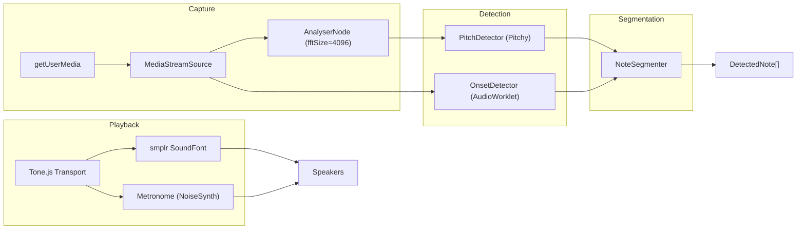

# Audio Pipeline

The audio pipeline handles everything from playing phrases through speakers to capturing notes from the microphone and converting them to scored note sequences.

## Pipeline Overview



## 1. Audio Context (`src/lib/audio/audio-context.ts`)

A singleton `AudioContext` shared between Tone.js and smplr. Must be initialized from a user gesture (click/tap) due to browser autoplay policies.

- `initAudio()` — Calls `Tone.start()`, returns the raw `AudioContext`. Idempotent.
- `getAudioContext()` — Returns the context (throws if not initialized).
- `isAudioInitialized()` — Boolean check.

Tone.js wraps the `AudioContext` in a `standardized-audio-context`. The raw context is passed to smplr so both libraries schedule on the same timeline.

## 2. Playback (`src/lib/audio/playback.ts`)

Plays phrases through SoundFont instrument samples using the Tone.js Transport for scheduling.

**Flow:**
1. `loadInstrument(instrumentId)` — Creates a `smplr.Soundfont` instance with the GM instrument name (e.g., `'tenor_sax'`). Cached via smplr's `CacheStorage`.
2. `playPhrase(phrase, options, keepMetronome)` — Converts phrase notes to Tone.js `Part` events using PPQ (Pulses Per Quarter) ticks for exact timing. Schedules metronome if enabled.
3. When `keepMetronome=true` (used during call-and-response), the Transport keeps running after the phrase ends so the metronome continues during recording.
4. `stopPlayback()` — Stops Transport, disposes Part, stops all ringing notes.

**Note conversion:** Phrase note offsets are fractions of a whole note (e.g., `[1, 4]` = quarter note). These are converted to quarter-note beats (`* 4`), then to Tone.js ticks (`* PPQ`), then scheduled as `"${ticks}i"` time strings.

## 3. Capture (`src/lib/audio/capture.ts`)

Sets up microphone input with processing-optimized constraints:

```typescript
audio: {
  echoCancellation: false,   // Don't filter the instrument signal
  noiseSuppression: false,   // Preserve harmonics
  autoGainControl: false     // Consistent levels
}
```

The `MediaStreamSource` connects to an `AnalyserNode` (fftSize=4096) but is **not** connected to the audio destination — this prevents feedback loops.

The `AnalyserNode` provides time-domain float data to the pitch detector. It also serves as the input level meter via `getInputLevel()`, which computes RMS and scales it to 0-1.

## 4. Pitch Detection (`src/lib/audio/pitch-detector.ts`)

Uses the [Pitchy](https://github.com/ianprime0509/pitchy) library which implements the **McLeod Pitch Method** — an autocorrelation-based algorithm well-suited for monophonic instruments.

**Detection loop:**
- Runs at ~60fps via `requestAnimationFrame`
- Reads `Float32Array` time-domain data from the `AnalyserNode`
- Calls `PitchDetector.findPitch(buffer, sampleRate)` → `[frequency, clarity]`
- Filters by: clarity >= 0.80, frequency 80–1200 Hz
- Converts frequency to MIDI via `12 * log2(freq / 440) + 69`
- Quantizes to nearest MIDI note + cents deviation
- Accumulates readings in an array with timestamps relative to recording start

Each `PitchReading` contains:
- `midiFloat` — Fractional MIDI number
- `midi` — Nearest integer MIDI
- `cents` — Deviation from nearest note (-50 to +50)
- `clarity` — Detection confidence (0-1)
- `time` — Seconds from recording start
- `frequency` — Raw Hz

## 5. Onset Detection (`src/lib/audio/onset-detector.ts` + `onset-worklet.ts`)

An `AudioWorklet` processor running on the audio thread for low-latency onset detection.

**Algorithm (energy-based with HFC):**
1. Compute **High-Frequency Content (HFC)**: `sum(|sample[i]| * (i + 1)) / N` — weights later samples in each 128-sample frame to emphasize transients.
2. Maintain an **Exponential Moving Average** (EMA) of HFC with smoothing factor 0.85.
3. If `HFC / EMA > 3.0` (threshold) and at least 60ms since last onset → fire onset event.
4. Silence detection: skip frames with energy below 0.001 to avoid noise triggers.
5. Let EMA settle for 5 frames before detecting.

Onset timestamps are posted to the main thread via `MessagePort` and collected relative to `recordingStartTime`.

## 6. Note Segmentation (`src/lib/audio/note-segmenter.ts`)

Combines pitch readings and onset timestamps into `DetectedNote[]`:

1. Use onset boundaries to divide pitch readings into segments.
2. For each segment:
   - Take the **median MIDI note** of all readings (robust to outliers)
   - Take the **median cents deviation** of readings matching the median MIDI
   - Compute average clarity of matching readings
3. Filter out segments shorter than `minNoteDuration` (default 50ms).
4. If no onsets were detected, treat all readings as one note.

## 7. Metronome (`src/lib/audio/metronome.ts`)

A synthesized jazz metronome using Tone.js `NoiseSynth`:

- **Ride cymbal**: White noise through an 8kHz highpass filter. Sounds on every beat, accented on beat 1.
- **Hi-hat chick**: Pink noise through a 6kHz highpass filter, very short envelope. Sounds on beats 2 and 4.
- Uses `Tone.Sequence` for pattern scheduling.
- Can run for a finite number of bars (during playback) or loop indefinitely (during recording).

## Recording Flow in Practice

The practice page (`src/routes/practice/+page.svelte`) orchestrates the full recording flow:

1. **Play**: Load instrument if needed, play phrase via `playPhrase()` with `keepMetronome=true`.
2. **Await input**: After phrase ends, pitch detection runs. The first detected pitch triggers recording.
3. **Record**: Pitch detector collects readings. Silence timeout (2s) or max duration triggers finish.
4. **Segment**: `extractOnsetsFromReadings()` detects onsets from pitch data (gap > 100ms or MIDI change). `segmentNotes()` produces `DetectedNote[]`.
5. **Score**: `scoreAttempt()` produces a `Score` with per-note results.

Note: The practice page uses a simpler onset detection from pitch readings rather than the AudioWorklet-based onset detector. The worklet-based detector is available for future use or more precise onset detection needs.
