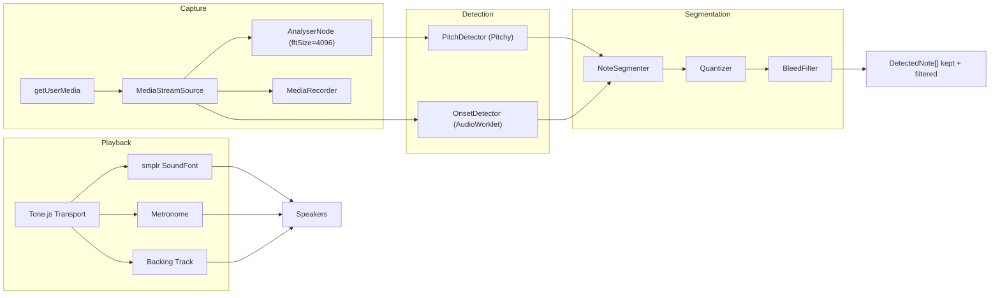

# Audio Pipeline

The audio pipeline handles everything from playing phrases through speakers to capturing notes from the microphone and converting them to scored note sequences.

## Pipeline Overview



## 1. Audio Context (`src/lib/audio/audio-context.ts`)

A singleton `AudioContext` shared between Tone.js and smplr. Must be initialized from a user gesture (click/tap) due to browser autoplay policies.

- `initAudio()` — Calls `Tone.start()`, returns the raw `AudioContext`. Idempotent.
- `getAudioContext()` — Returns the context (throws if not initialized).
- `isAudioInitialized()` — Boolean check.

Tone.js wraps the `AudioContext` in a `standardized-audio-context`. The raw context is passed to smplr so both libraries schedule on the same timeline.

## 2. Playback (`src/lib/audio/playback.ts`)

Plays phrases through SoundFont instrument samples using the Tone.js Transport for scheduling.

**Flow:**
1. `loadInstrument(instrumentId)` — Creates a `smplr.Soundfont` instance using the **MusyngKite** soundfont (richer wind samples than FluidR3_GM) with `loadLoopData: true` for natural sustained notes. Cached via smplr's `CacheStorage`. Previous instruments are disconnected on switch.
2. `playPhrase(phrase, options, keepMetronome)` — Converts phrase notes to Tone.js `Part` events using PPQ (Pulses Per Quarter) ticks for exact timing. Schedules metronome if enabled. Applies swing feel from settings.
3. When `keepMetronome=true` (used during call-and-response), the Transport keeps running after the phrase ends so the metronome continues during recording.
4. `stopPlayback()` — Stops Transport, disposes Part, stops all ringing notes.

**Note conversion:** Phrase note offsets are fractions of a whole note (e.g., `[1, 4]` = quarter note). These are converted to quarter-note beats (`* 4`), then to Tone.js ticks (`* PPQ`), then scheduled as `"${ticks}i"` time strings.

### Jazz Expression

The playback engine adds several layers of expression for authentic jazz sound:

- **Warmth filter**: A low-pass `BiquadFilterNode` at 4500 Hz (sax) / 6000 Hz (trumpet) with Q 0.7, inserted via smplr's `addInsert`. Rolls off harsh digital highs.
- **Vibrato**: A Web Audio `OscillatorNode` LFO at 4.8 Hz modulating the filter's detune at 12 cents depth (sax) / 6 cents (trumpet). Simulates jaw/airstream vibrato.
- **Breath-scoop detune**: Per-note `detune` values — the first note of a phrase gets -15 cents, lower notes get -8 cents, higher notes stay on pitch. Simulates a saxophonist's initial attack.
- **Humanized velocity**: Random +/-8 velocity deviation per note, avoiding robotic dynamics.
- **Humanized timing**: Micro-timing jitter of ~+/-15ms per note for organic feel.

### Swing Feel

The `swing` setting from `PlaybackOptions` (0.5 = straight, 0.67 = triplet, 0.75 = heavy) is mapped to Tone.js `transport.swing` (0–0.5) with `swingSubdivision` set to `'8n'`, giving authentic jazz eighth-note swing.

## 3. Capture (`src/lib/audio/capture.ts`)

Sets up microphone input with processing-optimized constraints:

```typescript
audio: {
  echoCancellation: false,   // Don't filter the instrument signal
  noiseSuppression: false,   // Preserve harmonics
  autoGainControl: false     // Consistent levels
}
```

The `MediaStreamSource` connects to an `AnalyserNode` (fftSize=4096) but is **not** connected to the audio destination — this prevents feedback loops.

The `AnalyserNode` provides time-domain float data to the pitch detector. It also serves as the input level meter via `getInputLevel()`, which computes RMS and scales it to 0-1.

## 4. Pitch Detection (`src/lib/audio/pitch-detector.ts`)

Uses the [Pitchy](https://github.com/ianprime0509/pitchy) library which implements the **McLeod Pitch Method** — an autocorrelation-based algorithm well-suited for monophonic instruments.

**Detection loop:**
- Runs at ~60fps via `requestAnimationFrame`
- Reads `Float32Array` time-domain data from the `AnalyserNode`
- Calls `PitchDetector.findPitch(buffer, sampleRate)` → `[frequency, clarity]`
- Filters by: clarity >= 0.80, frequency 80–1200 Hz
- Converts frequency to MIDI via `12 * log2(freq / 440) + 69`
- Quantizes to nearest MIDI note + cents deviation
- Accumulates readings in an array with timestamps relative to recording start

Each `PitchReading` contains:
- `midiFloat` — Fractional MIDI number
- `midi` — Nearest integer MIDI
- `cents` — Deviation from nearest note (-50 to +50)
- `clarity` — Detection confidence (0-1)
- `time` — Seconds from recording start
- `frequency` — Raw Hz

## 5. Onset Detection (`src/lib/audio/onset-detector.ts` + `onset-worklet.ts`)

An `AudioWorklet` processor running on the audio thread for low-latency onset detection.

**Algorithm (energy-based with HFC):**
1. Compute **High-Frequency Content (HFC)**: `sum(|sample[i]| * (i + 1)) / N` — weights later samples in each 128-sample frame to emphasize transients.
2. Maintain an **Exponential Moving Average** (EMA) of HFC with smoothing factor 0.85.
3. If `HFC / EMA > 3.0` (threshold) and at least 60ms since last onset → fire onset event.
4. Silence detection: skip frames with energy below 0.001 to avoid noise triggers.
5. Let EMA settle for 5 frames before detecting.

Onset timestamps are posted to the main thread via `MessagePort` and collected relative to `recordingStartTime`.

## 6. Note Segmentation (`src/lib/audio/note-segmenter.ts`)

Combines pitch readings and onset timestamps into `DetectedNote[]`:

1. Use onset boundaries to divide pitch readings into segments.
2. For each segment:
   - Take the **median MIDI note** of all readings (robust to outliers)
   - Take the **median cents deviation** of readings matching the median MIDI
   - Compute average clarity of matching readings
3. Filter out segments shorter than `minNoteDuration` (default 50ms).
4. If no onsets were detected, treat all readings as one note.

## 7. Metronome (`src/lib/audio/metronome.ts`)

A synthesized jazz metronome using Tone.js synths:

- **Kick drum** (beat 1): `MembraneSynth` tuned to C1 for a short membrane thump marking the downbeat.
- **Ride cymbal** (all beats): White noise through an 8kHz highpass filter.
- **Hi-hat chick** (beats 2 and 4): Pink noise through a 6kHz highpass filter, very short envelope.
- Uses `Tone.Sequence` for pattern scheduling.
- Can run for a finite number of bars (during playback) or loop indefinitely (during recording).

## Recording Flow in Practice

The practice page (`src/routes/practice/+page.svelte`) orchestrates the full recording flow:

1. **Play**: Load instrument if needed, play phrase via `playPhrase()` with `keepMetronome=true`.
2. **Await input**: After phrase ends, pitch detection runs. The first detected pitch triggers recording.
3. **Record**: Pitch detector collects readings. Silence timeout (2s) or max duration triggers finish.
4. **Segment**: `extractOnsetsFromReadings()` detects onsets from pitch data (gap > 100ms or MIDI change). Gap-based onsets are **back-dated by 50ms** to compensate for pitch detector re-lock delay after silence (see Scoring Algorithm docs). `segmentNotes()` produces `DetectedNote[]`.
5. **Score**: `scoreAttempt()` produces a `Score` with per-note results.

The practice page prefers the AudioWorklet onset detector when available. It creates the worklet on first mic capture (`ensureMicCapture()`) and calls `reset(recordingStartTime)` before each recording pass to synchronize timestamps with the pitch detector. If the AudioWorklet is unavailable (e.g., unsupported browser), it falls back to `extractOnsetsFromReadings()` which derives onsets from pitch data gaps and MIDI changes.

## 8. Backing Track (`src/lib/audio/backing-track.ts` + `backing-track-schedule.ts` + `backing-styles.ts`)

Generates and schedules a three-part jazz rhythm section (upright bass, piano or organ comping, drum kit) synchronized to phrase harmony on the Tone.js Transport.

- **Bass**: Smolken pizzicato double-bass sample library; walking lines built per `HarmonicSegment` using chord tones and passing tones.
- **Comping**: `smplr.SplendidGrandPiano` (Salamander Grand) or drawbar organ (GM SoundFont, MusyngKite). Voicings are built via `voicings.ts` — shell voicings + voice-leading to minimize hand motion between chords.
- **Drums**: Sampled kick, ride, hi-hat (Virtuosity Drums, CC0) loaded through `sample-maps.ts`. Patterns are defined in `backing-styles.ts` and include swing, straight, bossa, and ballad feels.
- **Schedule**: `buildSchedule()` returns a `BackingTrackSchedule` — a time-indexed structure with `notes[]` (bass/comp note events with `startSeconds`, `endSeconds`, `midi[]`) and an `activeMidiAt(time)` lookup. The schedule is consumed by the bleed filter.
- **Diagnostics**: A `BackingTrackLog` (per-beat dump of bass/comp/drum/melody activity) is produced for the `/diagnostics` panel.

Because `echoCancellation` is disabled on the mic (to preserve instrument pitch accuracy), the backing track is audible in the user's recording. Two mitigations:

1. The backing track gain is ducked during the `awaitingInput` phase so bleed cannot falsely trigger `beginRecording()`.
2. The bleed filter runs between segmentation and scoring (see below).

## 9. Bleed Filter (`src/lib/audio/bleed-filter.ts`)

Reference-aware filter that rejects detected notes which probably came from the backing track bleeding into the mic rather than from the user's instrument. It uses `clarity` (autocorrelation confidence) as a proxy for signal strength — direct instrument input typically produces clarity ≥ 0.92; speaker bleed at typical distances lands in 0.80–0.88.

Per detected note, given the `BackingTrackSchedule`:

1. If no backing-track pitch is active at the note's transport time (octave-folded pitch-class match) → **keep**.
2. If `clarity >= 0.92` → **keep** (even if the pitch matches — the user is playing the same note).
3. If `clarity < 0.88` → **filter** (weak signal on a matching pitch = bleed).
4. Borderline clarity (0.88–0.92) on a matching pitch → check onset coincidence: if a backing note begins within 50 ms of the detected onset → **filter**; otherwise → **keep**.

The filter returns `{ kept, filtered }`. `score-pipeline.ts` passes both lists to `scoreAttempt()` so the unfiltered and filtered scores can be compared in diagnostics.

## 10. Quantizer (`src/lib/audio/quantizer.ts`)

Snaps detected onsets to the Transport's subdivision grid (quarter, eighth, triplet, sixteenth). Used by the lick-practice continuous flow so the notation overlay stays on a clean rhythmic grid even when the user's timing drifts.

## 11. Recording & Replay (`src/lib/audio/recorder.ts` + `replay.ts` + `persistence/audio-store.ts`)

`recorder.ts` wraps `MediaRecorder` to persist raw microphone audio per attempt. `persistence/audio-store.ts` stores blobs in IndexedDB (bounded, FIFO). `replay.ts` reads a stored blob and feeds it through the full detection + scoring pipeline again, which drives the `/diagnostics` rescore panel.

## Recording Flow in Practice

The practice page (`src/routes/practice/+page.svelte`) orchestrates the full recording flow:

1. **Play**: Load instrument if needed, play phrase via `playPhrase()` with `keepMetronome=true`.
2. **Await input**: After phrase ends, pitch detection runs and backing-track gain is ducked. The first detected pitch triggers recording.
3. **Record**: Pitch detector collects readings. Silence timeout (2s) or max duration triggers finish.
4. **Segment**: `extractOnsetsFromReadings()` detects onsets from pitch data (gap > 100ms or MIDI change). Gap-based onsets are **back-dated by 50ms** to compensate for pitch detector re-lock delay after silence (see Scoring Algorithm docs). `segmentNotes()` produces `DetectedNote[]`.
5. **Bleed filter**: `filterBleed()` splits the notes into `kept` / `filtered`.
6. **Score**: `runScorePipeline()` runs `scoreAttempt()` on both the unfiltered and filtered sets.

The record and lick-practice flows use the AudioWorklet onset detector directly (it fires onset events on the audio thread), skipping the gap-inference path.
