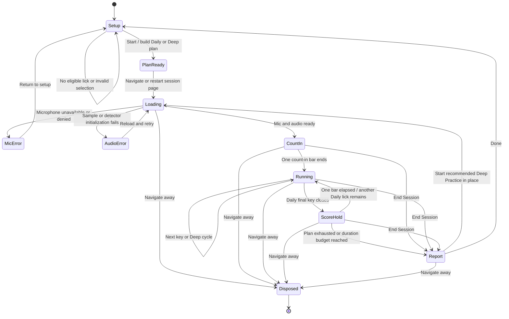
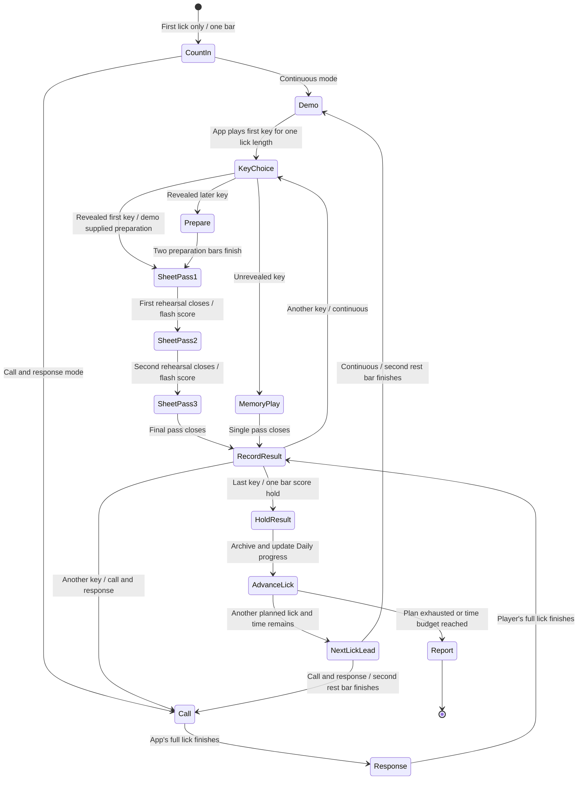
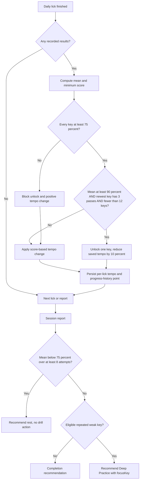
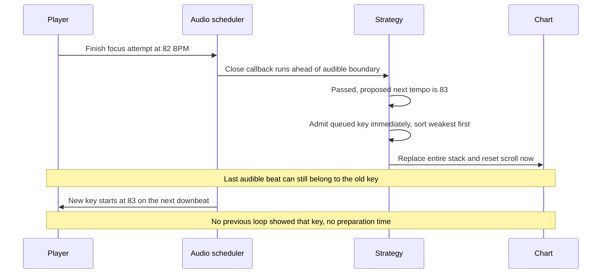
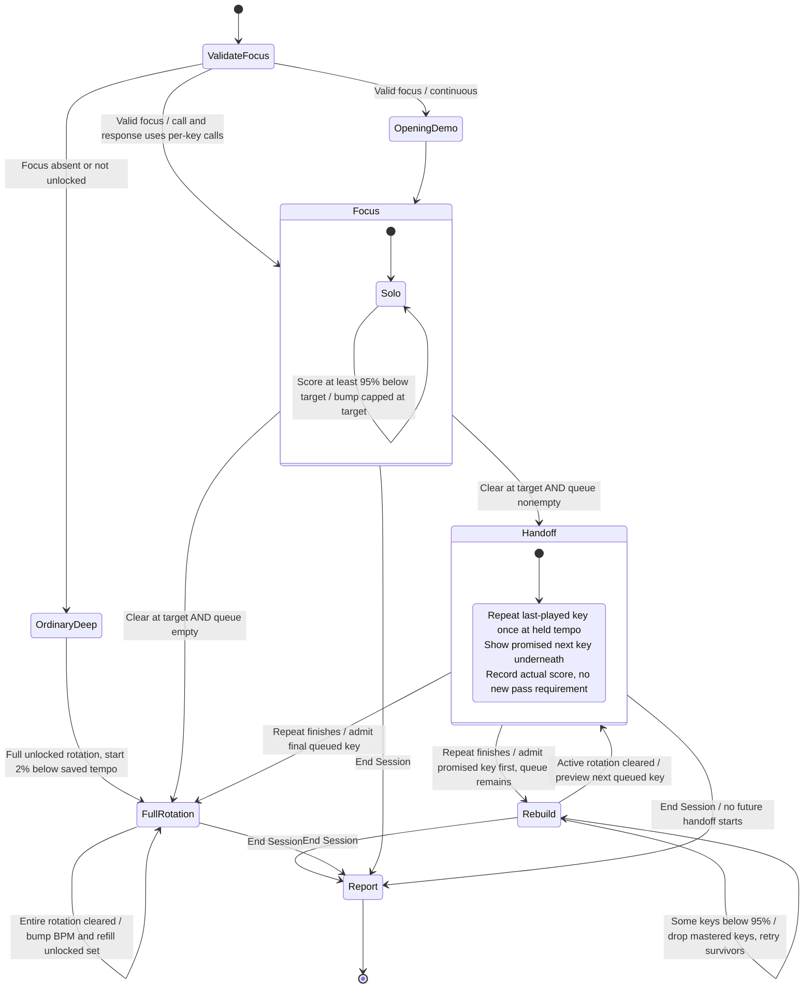
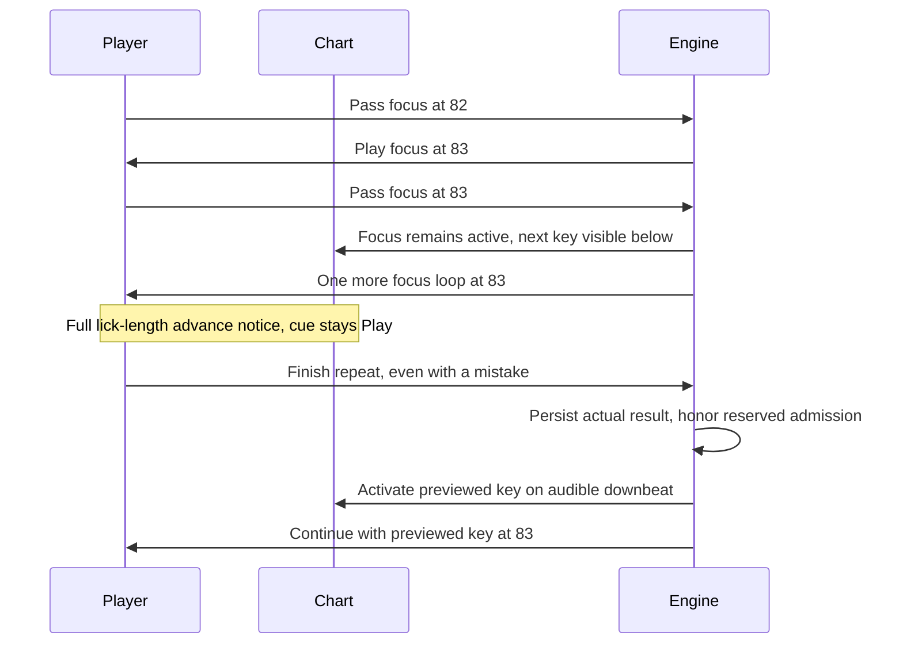
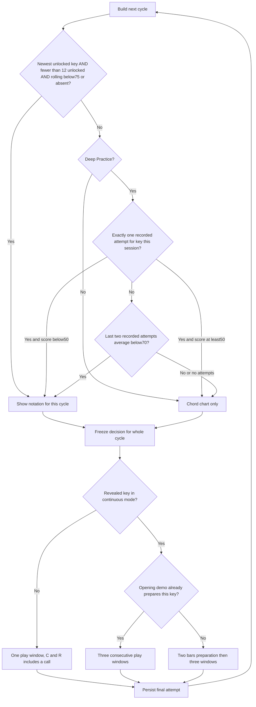
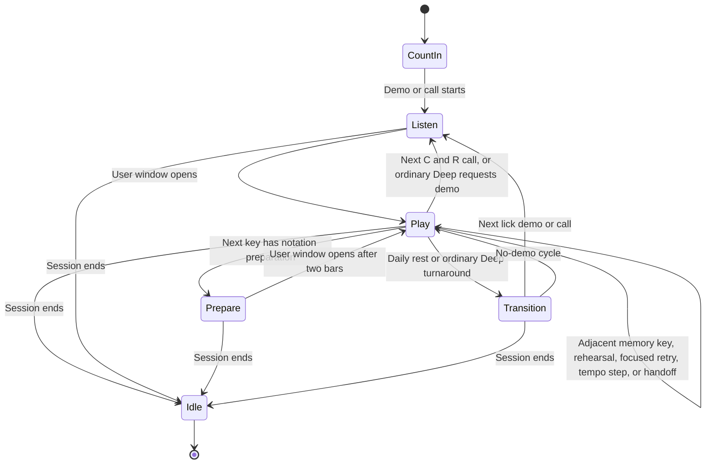
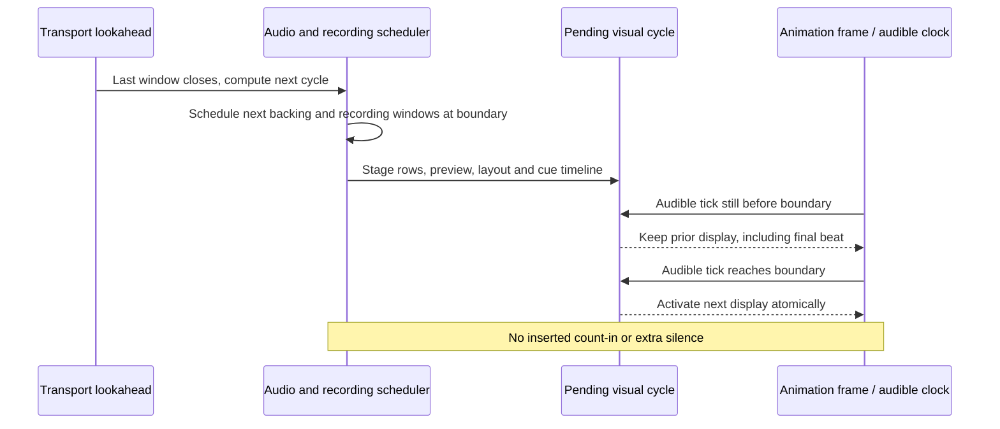

# Daily and recommended Deep Practice: state machines

Code audit: 2026-10-01, baseline `03016a51`. Written before the handoff implementation. Sections marked **new handoff** specify the change; the other sections describe the existing engine. This document concerns lick practice, not tune practice or trick drills.

## Reading the diagrams

There are three simultaneous state machines, not one:

| Layer | States | Owns |
| --- | --- | --- |
| Session lifecycle | setup, count-in, lick-running, inter-lick-rest, complete | Loading, scheduling, plan advancement, report |
| Musical activity | count-in, listen, read/preparation, play, transition, idle | What the player should do now; derived from recording windows |
| Recommended Deep strategy | focus, **handoff (new)**, rebuild, complete | Which keys enter the next cycle and at what tempo |

Notation is a separate per-key decision. **Playing with sheet music is still PLAY.** The internal `read` phase means a timed preparation period with the microphone's scoring window closed. It is not the entire time the sheet is visible. A `complete` focus ramp means the drill continues with its full rotation; a `complete` session means playback stops and the report opens.

All score comparisons below use unrounded values. A displayed 70% can represent a value just below 70%. A loop is the entire effective lick length, including any extension beyond the progression. A bar uses the phrase's time signature; the final entrance cue counts at most four beats.

## 1. Shared session lifecycle

Loading prebuilds the chart, acquires the mic, loads samples and starts pitch detection. The elapsed practice clock begins when transport playback starts, excluding loading and permission dialogs. Initialization continuations check whether the page was destroyed. Teardown cancels future transport work, stops instruments and detectors, releases the mic, and discards an unfinished recording window. Completed attempts already written remain available.

This lifecycle diagram names the stages the player experiences. Loading, errors, score hold and disposal are page-local flags, not extra `LickPracticePhase` enum values. In particular, `startLick` sets the coarse enum to `lick-running` while scheduling the first bar; the audible count-in/listen/play distinctions come from the finer musical timeline. The mic can be acquired and its detector running while the scored recording window is closed.

End Session creates a report from completed attempts, including an in-progress lick's completed keys. Daily completion during its score-hold bar still runs that lick's advancement bookkeeping. Deep Practice has no duration cutoff: the user ends it. A missing plan redirects to setup. There is no pause/resume state in this flow.

## 2. Daily plan and one complete lick

Daily collects eligible practice-tagged licks across progressions, ordered least recently practiced first. Each lick gets a compatible progression from its tags/history, its saved tempo (new lick default 60 BPM), and its unlocked key set. Under twelve unlocked keys it uses the unlock order; fully unlocked licks use the tempo-dependent key planner. Whole licks fill the duration budget, with one oversized lick permitted so Start is not a no-op. The displayed duration estimates demos, notation rehearsals, preparation, count-in and score hold.

| State | Audio and microphone | Screen and player action | Exit |
| --- | --- | --- | --- |
| Count-in | One bar; no scored recording | Initial chart; entrance cue leads to listening | First demo or call |
| Demo | Melody plus enabled backing; no scored recording | Listen; first sheet already visible if eligible | After one full lick |
| Memory play | Backing; recording window open | Play; chord chart and beat dots | One lick closes |
| Preparation (`read`) | Two bars of vamp; no scored recording | Sheet becomes visible; prepare, then final four-beat Play entrance cue | First sheet pass |
| Sheet rehearsal 1 and 2 | Backing; captured and scored | Play from visible sheet; inline feedback | Immediately next pass, no gap |
| Sheet final pass | Backing; captured and scored | Play; sheet remains visible | Persist one attempt for that key |
| Call | App plays lick; no scored recording | Listen; sheet visible if eligible | Player response |
| Response | Backing; scored recording | Play; one response even if sheet is visible | Persist result |
| Score hold | First rest bar, no scored recording | Finished lick's feedback/breather | Advance bookkeeping |
| Next-lick lead | Second rest bar, enabled ii–V cue into next key | Next chart shown before demo/call | Next lick downbeat |

The three sheet passes are not three persisted attempts. Only the final pass updates progress, report and recording history. Current production keeps the sheet visible for all three; the comment describing “play it from memory” is not an enforced hide-on-third-pass behavior.

## 3. Daily advancement and recommendation

Daily tempo adjustment: mean ≥95%: +2 BPM; ≥90%: +1; ≥75%: −1; below75%: −3. A minimum below75% caps the delta at zero. A key unlock replaces the delta with the 10% reduction. Tempo is clamped to 50–300 BPM. A persisted pass means ≥90%, distinct from Deep's ≥95% mastery/drop threshold.

Recommendations use up to five recent sittings per key, deduplicating retries and progression slices. More than half must be below90%. Learning licks (fewer than twelve keys) rank before fully unlocked licks; fully unlocked keys additionally need at least three weak sittings. Within that priority the lower median wins. The recommendation passes the lick and `focusKey` to Deep; it does not unlock a new key.

## 4. Recommended Deep Practice: strategy and key admission

Opening: validate that the focus key is unlocked; start that key alone at saved tempo minus 10% (rounded to the nearest BPM, at least a 1 BPM reduction unless already at the minimum50). Queue the other unlocked keys worst first by rolling score, with never-practiced keys first. Keep the complete unlocked set as the stable progress ring. Continuous mode plays one opening demo; later misses and tempo changes do not request another demo.

### Baseline failure, before this change

The old “up to speed” milestone also described the *next* BPM, rather than a successful attempt actually performed at the target.

### New handoff: repeat the just-cleared key and show what follows

`handoff` is an internal strategy state. Musically it is still **PLAY**, not a new instruction, countdown, listening phase or rest. After clearing the focus key at the actual target, repeat it once while the next key's chord chart is already visible below it. Then start the promised key first in the rebuilt rotation. The final repeat cannot revoke admission or lower tempo. Its genuine score is still recorded.

Use the same one-loop handoff for later admissions: after clearing the remaining active keys, repeat the last-played key while showing the queued key. This prevents the same surprise when the rotation grows from two to three keys and beyond. Do not repeat an entire multi-key rotation just to provide notice. If there is no queued key, no handoff is needed.

| Boundary | Next audio rotation | Tempo | Advance visibility |
| --- | --- | --- | --- |
| Focus below75% | Same focus | Subtract ceil(BPM × 3 × bump%); minimum50 | Same key |
| Focus 75%–<95%, or missing score | Same focus | Hold | Same key |
| Focus ≥95%, performed below target | Same focus | Add ceil(BPM × bump%), at least1; cap at target | Same key |
| Focus ≥95%, performed at target | Repeat focus once; reserve queue head | Hold target | Reserved key appears underneath for this whole loop |
| Handoff loop ends, any score or missing score | Reserved key **first**, then previously admitted keys worst first | Hold | The promised chart becomes active on the audible downbeat |
| Rebuild has survivors | Survivors worst first | Hold target | Existing cycle charts |
| Rebuild clears | Repeat last-played key once; reserve queue head | Hold target | Reserved chart below repeat |
| All keys admitted, survivors | Survivors worst first | Hold | Existing cycle charts |
| All keys admitted, full clear | Full currently unlocked circle worst first | Bump, maximum300 | Ordinary Deep refill behavior |

Example with target83 and default1% bump:

If that newly admitted key needs notation, its normal sheet-preparation rule still applies; the handoff does not remove support for unfamiliar material. An unopened queue key's preview is a chord chart, not early sheet music. Once the ramp completes, ordinary refill/reordering remains score-driven; this change specifically makes *new admissions* predictable.

## 5. Notation decision and learning substates

The **new handoff repeat** is a special case: one play window, no additional notation-preparation pause for a key the player just played. Call-and-response retains its explicit call. The queued preview does not enter this cycle's audio, score windows, or key ring results.

Important boundaries:

- 50% exactly does not trigger the first-attempt rescue; 70% exactly does not trigger the two-attempt rescue. These use final recorded attempts, not rehearsal scores or EWMA.
- Rescue applies to any unlocked Deep key, including older keys and fully unlocked licks. Daily uses the legacy newest-key rule only.
- Sheet graduation is reevaluated at the next cycle: no legacy reveal and no rescue condition means return to the chord chart. A slight memory mistake does not automatically start another Listen phase in a recommended drill.
- A sheet is engraved ahead, but remains hidden behind its chord-chart placeholder until that key becomes current, at the beginning of preparation. The next key is not illuminated as though already active.
- A row remains current through preparation and every pass. Previous-row feedback stays visible above it where the stack has room. Mixed sheet/chord row heights determine the viewport so beat dots are not clipped.

## 6. Musical cues, boundaries, and clocks

The phase timeline is derived from the very same window plan as recording. Consecutive play windows merge into one PLAY segment. Final four-beat entrance cues are for an actual return to playing, not every key boundary. Current labels: Listen, Read, Play, Rest, and “Straight in” for a transition directly to Play. The compact “Get ready” Daily design preview is provisional; it is not the production label mapped here.

| Session/mode | Opening | Between cycles/licks |
| --- | --- | --- |
| Daily continuous | One count-in bar, then one demo per lick | Two rest bars: score hold then next-lick lead |
| Daily call and response | One count-in bar, then per-key call | Same Daily rest, then next call |
| Recommended Deep continuous | One count-in bar and one opening demo | Zero added bars, including misses, tempo changes, handoffs and post-ramp cycles |
| Ordinary Deep continuous | One count-in bar and opening demo | One turnaround bar; on non-clear cycles a head key below90%/unpracticed may get a demo |
| Deep call and response | One count-in bar; call before each response | Existing one-bar turnaround; calls remain intentional |
| Actually late focused callback | Opening unchanged | Recover at a future safe bar; cannot schedule audio into the past |

Scheduling and display must use different notions of “now.” Tone schedules sound ahead of the speaker's audible clock. **New handoff timing rule:** prepare the next cycle's audio/windows during lookahead, but hold the current chart, key name, active row, beat position and cue until the new cycle's audible start tick. Commit all visual cycle data together. End Session clears any pending display so a scheduled handoff cannot reappear afterward.

## 7. Persistence and terminal behavior

| Data | Daily | Recommended Deep |
| --- | --- | --- |
| Final-attempt score, rolling score, ≥90% pass count, recency | Persist | Persist, including handoff repeat's genuine result |
| Rehearsal-only score | Inline feedback only | Inline feedback only |
| Recording | Final pass only | Final pass only |
| Saved lick tempo | Adjust after completed lick | Unchanged by session ramp |
| Newly unlocked keys | Daily gate can unlock one | Never unlocked by lick Deep Practice |
| Session log/report | Upsert after attempts and final flush | Same; include round history and ramp milestones |
| Focus/rebuild/handoff strategy | Not applicable | Session-local; reset on restart/exit |
| Up-to-speed milestone | Not applicable | New behavior: actual target-tempo clear, not prospective bump |
| Rebuilt milestone | Not applicable | Round that actually admits final queued key |

Scoring/recording persistence failures are caught so one failed save cannot freeze the session's cycle boundary. A missing scored result is not a pass; it does not advance a focus staircase. The committed handoff is the deliberate exception: a missing or low final-repeat score does not cancel the already announced next key.

## Code map and regression obligations

| Concern | Source |
| --- | --- |
| Daily plan, session state, notation decisions, attempts and progress | `src/lib/state/lick-practice.svelte.ts` |
| Focus policy, pure cycle/window timing and playhead position | `src/lib/state/lick-practice-rotation.ts` |
| Cue timeline and user-facing cue labels | `src/lib/state/lick-practice-phase.ts` |
| Duration/count-in/rest constants | `src/lib/state/lick-practice-duration.ts` |
| Daily recommendation evidence/ranking | `src/lib/state/lick-practice-next-steps.ts` |
| Score thresholds, unlock and tempo persistence | `src/lib/persistence/lick-practice-store.ts` |
| Transport, mic windows, cycle boundary, display and report | `src/routes/lick-practice/session/+page.svelte` |
| Chart stack, notation visibility, compact cue and geometry | `src/lib/components/lick-practice/UpcomingKeysDisplay.svelte` |

Regression obligations: 82→83 alone before actual target clear; full-loop preview after clear; low/missing final-repeat score cannot revoke the promised key or change tempo; promised key starts first despite rolling-score reordering; later admissions receive the same preview; single-key licks need no preview; preview creates no audio/recording window; no added demo/preparation in a continuous handoff; old chart survives lookahead through its final audible beat; End Session cancels staged display; existing Daily preparation, Deep rescue thresholds, layout and persisted-tempo behavior remain intact.
