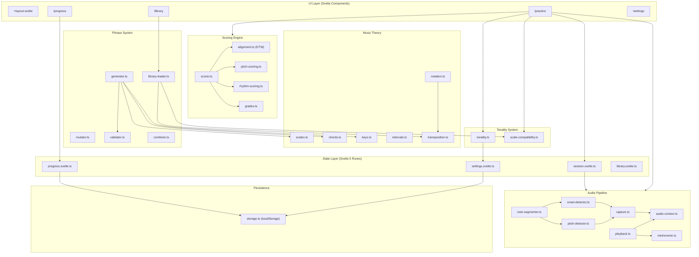

# Architecture Overview

## System Design

Mankunku is a client-side SvelteKit application with no backend. All processing — audio capture, pitch detection, scoring, and progress tracking — happens in the browser.

## Data Flow: A Practice Session

1. **Phrase Selection**: User picks a phrase from the library or the generator creates one based on difficulty/category/key settings.
2. **Playback**: `playback.ts` schedules the phrase notes on the Tone.js Transport, plays them through smplr SoundFont samples, and optionally starts the metronome.
3. **Recording**: After playback completes, the app enters "awaiting input" mode. The pitch detector runs at ~60fps via `requestAnimationFrame`. The first detected pitch starts the recording timer.
4. **Note Segmentation**: When recording ends (silence timeout or max duration), pitch readings and onset timestamps are combined into `DetectedNote[]` by `note-segmenter.ts`.
5. **Scoring**: `scorer.ts` anchors detected notes to the beat grid, runs DTW alignment, corrects for latency, and produces per-note pitch and rhythm scores.
6. **Feedback**: The `FeedbackPanel` component displays the grade, overall score, and per-note comparison.
7. **Progress Update**: The attempt is recorded in `progress.svelte.ts`, which updates the adaptive difficulty state, category/key stats, and streak.

## Module Boundaries

The codebase follows clear module boundaries:

- **Types** (`src/lib/types/`): Pure TypeScript interfaces and type definitions. No runtime code.
- **Music theory** (`src/lib/music/`): Pure functions operating on MIDI numbers, pitch classes, and scales. No side effects, no browser APIs.
- **Audio** (`src/lib/audio/`): Manages the Web Audio API graph. The only modules that touch `AudioContext`, `MediaStream`, and `AudioWorklet`.
- **Scoring** (`src/lib/scoring/`): Pure functions that take expected notes + detected notes and produce scores. No audio or UI dependencies.
- **Phrases** (`src/lib/phrases/`): Generates, mutates, validates, and queries phrases. Depends on music theory but not on audio or UI.
- **Tonality** (`src/lib/tonality/`): Daily tonality selection, progressive unlocking, and scale-aware lick filtering. Pure functions, no UI dependencies.
- **Difficulty** (`src/lib/difficulty/`): Pure algorithm for adjusting difficulty based on performance. No UI dependencies.
- **State** (`src/lib/state/`): Svelte 5 rune-based reactive state. The bridge between UI and logic.
- **Components** (`src/lib/components/`): Reusable Svelte components. Each accepts props and emits events.
- **Routes** (`src/routes/`): SvelteKit pages. Compose components, connect state, and handle user interactions.
- **Persistence** (`src/lib/persistence/`): Thin localStorage wrapper. Used by state modules.

## Key Architectural Decisions

1. **No backend**: Everything runs client-side. Progress is stored in localStorage. This enables offline use and simplifies deployment.
2. **Shared AudioContext**: Tone.js and smplr share the same `AudioContext` so that Transport scheduling and sample playback are on the same timeline.
3. **Concert pitch as canonical**: All data is stored in concert pitch. Transposition to written pitch (for Bb/Eb instruments) happens only at the display layer via `notation.ts` and `transposition.ts`.
4. **DTW for alignment**: Dynamic Time Warping handles timing differences between expected and played notes, making scoring robust against slight tempo variations.
5. **Latency correction**: The scorer computes the median timing offset of matched note pairs and subtracts it, absorbing constant human reaction time and detection delay.
6. **PWA**: The app is installable as a Progressive Web App via `@vite-pwa/sveltekit`, with Workbox service worker caching SoundFont files.
