# Architecture Overview

## System Design

Mankunku is local-first: all audio capture, pitch detection, scoring, and progress tracking runs in the browser. An optional Supabase-backed backend layer handles authentication, cross-device progress sync, and user-defined lick management — the app ships with a SvelteKit Node adapter (`adapter-node`) and a small set of server endpoints under `/api/account/` for account operations. When the user is signed out or offline, every feature still works against localStorage.

```mermaid
graph TD
    subgraph UI ["UI Layer (Svelte Components)"]
        Layout["+layout.svelte"]
        Practice["/practice"]
        LickPractice["/lick-practice"]
        Library["/library"]
        Progress["/progress"]
        Settings["/settings"]
        Scales["/scales"]
        Entry["/entry"]
        AddLicks["/add-licks"]
        Record["/record"]
        Diagnostics["/diagnostics"]
    end

    subgraph State ["State Layer (Svelte 5 Runes)"]
        Session["session.svelte.ts"]
        LickPracticeState["lick-practice.svelte.ts"]
        SettingsState["settings.svelte.ts"]
        ProgressState["progress.svelte.ts"]
        HistoryState["history.svelte.ts"]
        LibraryState["library.svelte.ts"]
        StepEntryState["step-entry.svelte.ts"]
    end

    subgraph Audio ["Audio Pipeline"]
        AudioCtx["audio-context.ts"]
        Playback["playback.ts"]
        Capture["capture.ts"]
        PitchDet["pitch-detector.ts + pitch-frame.ts"]
        OnsetCore["onset-core.ts + onset-detector.ts + onset-worklet.js"]
        Segmenter["note-segmenter.ts"]
        Quantizer["quantizer.ts"]
        BleedFilter["bleed-filter.ts"]
        Metro["metronome.ts"]
        Recorder["recorder.ts"]
        Replay["replay.ts"]
        Backing["backing-track.ts + backing-track-schedule.ts + backing-styles.ts"]
        Voicings["voicings.ts + sample-maps.ts"]
    end

    subgraph Scoring ["Scoring Engine"]
        Pipeline["score-pipeline.ts"]
        Scorer["scorer.ts"]
        Alignment["alignment.ts (DTW)"]
        PitchScore["pitch-scoring.ts"]
        RhythmScore["rhythm-scoring.ts"]
        Grades["grades.ts"]
    end

    subgraph Music ["Music Theory"]
        Scales["scales.ts"]
        Chords["chords.ts"]
        Keys["keys.ts"]
        KeyOrdering["key-ordering.ts"]
        Intervals["intervals.ts"]
        Notation["notation.ts"]
        Transposition["transposition.ts"]
    end

    subgraph Phrases ["Phrase System"]
        Generator["generator.ts"]
        Mutator["mutator.ts"]
        Validator["validator.ts"]
        Combiner["combiner.ts"]
        LibLoader["library-loader.ts"]
    end

    subgraph Tonality ["Tonality System"]
        TonalityMod["tonality.ts"]
        ScaleCompat["scale-compatibility.ts"]
    end

    subgraph Persistence
        Storage["storage.ts (localStorage)"]
        UserLicks["user-licks.ts"]
        LickRec["lick-practice-recording.ts"]
        LickStore["lick-practice-store.ts"]
        AudioStore["audio-store.ts (IndexedDB)"]
        Sync["sync.ts"]
        Supabase["supabase/* (cloud, auth)"]
    end

    Practice --> Session
    Practice --> Audio
    Practice --> Scoring
    LickPractice --> LickPracticeState
    LickPractice --> Audio
    Library --> LibLoader
    Library --> LibraryState
    Progress --> ProgressState
    Progress --> HistoryState
    Entry --> StepEntryState
    AddLicks --> StepEntryState

    Session --> Audio
    SettingsState --> Storage
    ProgressState --> Storage
    HistoryState --> Storage
    LickPracticeState --> Storage
    Storage --> Supabase

    Playback --> AudioCtx
    Playback --> Metro
    Capture --> AudioCtx
    PitchDet --> Capture
    OnsetDet --> Capture
    Segmenter --> PitchDet
    Segmenter --> OnsetDet

    Pipeline --> Scorer
    Pipeline --> BleedFilter
    Scorer --> Alignment
    Scorer --> PitchScore
    Scorer --> RhythmScore
    Scorer --> Grades

    Generator --> Scales
    Generator --> Chords
    Generator --> Keys
    Generator --> Validator
    LibLoader --> Transposition
    LibLoader --> ScaleCompat

    Practice --> TonalityMod
    Practice --> ScaleCompat
    TonalityMod --> SettingsState

    Notation --> Transposition
```

## Data Flow: A Practice Session

1. **Phrase Selection**: User picks a phrase from the library or the generator creates one based on difficulty/category/key settings.
2. **Playback**: `playback.ts` schedules the phrase notes on the Tone.js Transport, plays them through smplr SoundFont samples, and optionally starts the metronome and/or a backing track (`backing-track.ts`).
3. **Recording**: After playback completes, the app enters "awaiting input" mode. In the ear-training path the pitch detector runs at ~60fps via `requestAnimationFrame`; in the record / lick-practice path the AudioWorklet-based onset detector fires events directly. The first detected pitch or onset starts the recording timer.
4. **Note Segmentation**: When recording ends (silence timeout, bar boundary, or max duration), pitch readings and onset timestamps are combined into `DetectedNote[]` by `note-segmenter.ts`.
5. **Bleed Filter (optional)**: `bleed-filter.ts` classifies detected notes as kept or filtered based on backing-track bleed heuristics. Both results are carried forward so diagnostics can compare them.
6. **Scoring**: `score-pipeline.ts` runs `scoreAttempt()` on the unfiltered notes and, when a bleed result is present, on the filtered notes. The scorer anchors detected notes to the beat grid, runs DTW alignment, corrects for constant human latency (median offset), and produces per-note pitch and rhythm scores plus timing diagnostics.
7. **Feedback**: The `FeedbackPanel` component displays the grade, overall score, liner-note caption, and per-note comparison.
8. **Progress Update**: The attempt is recorded in `progress.svelte.ts` (ear-training) or `lick-practice.svelte.ts` (lick-practice), which updates adaptive difficulty, category/key stats, streaks, and the `history.svelte.ts` daily summary.
9. **Optional Replay**: Raw audio can be stored in IndexedDB via `audio-store.ts` and re-scored later (`replay.ts` + `/diagnostics`).

## Module Boundaries

The codebase follows clear module boundaries:

- **Types** (`src/lib/types/`): Pure TypeScript interfaces and type definitions. No runtime code.
- **Music theory** (`src/lib/music/`): Pure functions operating on MIDI numbers, pitch classes, and scales. No side effects, no browser APIs.
- **Audio** (`src/lib/audio/`): Manages the Web Audio API graph. The only modules that touch `AudioContext`, `MediaStream`, and `AudioWorklet`.
- **Scoring** (`src/lib/scoring/`): Pure functions that take expected notes + detected notes and produce scores. No audio or UI dependencies.
- **Phrases** (`src/lib/phrases/`): Generates, mutates, validates, and queries phrases. Depends on music theory but not on audio or UI.
- **Tonality** (`src/lib/tonality/`): Daily tonality selection, progressive unlocking, and scale-aware lick filtering. Pure functions, no UI dependencies.
- **Difficulty** (`src/lib/difficulty/`): Pure algorithm for adjusting difficulty based on performance. No UI dependencies.
- **State** (`src/lib/state/`): Svelte 5 rune-based reactive state. The bridge between UI and logic.
- **Components** (`src/lib/components/`): Reusable Svelte components. Each accepts props and emits events.
- **Routes** (`src/routes/`): SvelteKit pages. Compose components, connect state, and handle user interactions.
- **Persistence** (`src/lib/persistence/`): localStorage + IndexedDB wrappers, plus Supabase cloud sync. Used by state modules. Key files: `storage.ts` (localStorage helpers), `audio-store.ts` (IndexedDB for recorded audio), `user-licks.ts` (user-authored licks), `lick-practice-store.ts` + `lick-practice-recording.ts` (lick-practice progress and per-session recordings), `sync.ts` (Supabase background sync).
- **Supabase** (`src/lib/supabase/`): Browser and server client factories, auth helpers, and generated DB types for the optional backend layer.
- **Step Entry** (`src/lib/step-entry/`): Helpers for manual lick entry — note-duration metadata and pitch-input accidental logic.
- **Util** (`src/lib/util/`): Small shared utilities (e.g. `seeded-shuffle.ts`).

## Key Architectural Decisions

1. **Local-first with optional backend**: All scoring, pitch detection, and audio logic runs client-side, and every feature works offline against localStorage. A Supabase-backed backend layer (auth, cross-device progress sync, user-lick storage) is optional — when the user is signed in, localStorage writes are mirrored to Supabase in the background, and a small set of `/api/account/` server endpoints handle account operations.
2. **Shared AudioContext**: Tone.js and smplr share the same `AudioContext` so that Transport scheduling and sample playback are on the same timeline.
3. **Concert pitch as canonical**: All data is stored in concert pitch. Transposition to written pitch (for Bb/Eb instruments) happens only at the display layer via `notation.ts` and `transposition.ts`.
4. **DTW for alignment**: Dynamic Time Warping handles timing differences between expected and played notes, making scoring robust against slight tempo variations.
5. **Latency correction**: The scorer computes the median timing offset of matched note pairs and subtracts it, absorbing constant human reaction time and detection delay.
6. **PWA**: The app is installable as a Progressive Web App via `@vite-pwa/sveltekit`, with Workbox service worker caching SoundFont files.
