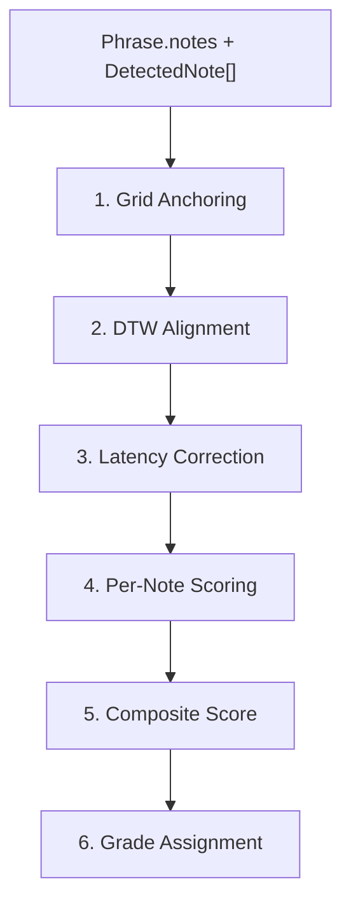

# Scoring Algorithm

The scoring engine takes expected notes (from a `Phrase`) and detected notes (from the microphone pipeline) and produces a `Score` with per-note pitch and rhythm accuracy.

**Source files:** `src/lib/scoring/`

## Pipeline



## 0. Onset Time Compensation (Practice Page)

Before notes reach the scoring pipeline, the practice page's `extractOnsetsFromReadings()` function detects note onsets from pitch readings. When a gap > 100ms is detected (indicating silence, e.g., a breath between bars), the onset is **back-dated by 50ms** (`ATTACK_LATENCY`) to compensate for the pitch detector's re-lock delay.

**Why:** After silence, the AnalyserNode buffer clears and the pitch detector needs several frames to rebuild clarity above the 0.80 threshold. This introduces a systematic delay on the first note after any breath, which disproportionately penalizes bar-boundary notes (e.g., the first note of bar 2). The compensation corrects this at the source.

```
if (gap > GAP_THRESHOLD):
    onset = reading.time - ATTACK_LATENCY  // 50ms back-date
else if (noteChanged):
    onset = reading.time                    // no compensation needed
```

## 1. Grid Anchoring (`scorer.ts:anchorToGrid`)

Detected notes have `onsetTime` relative to when the pitch detector started. To compare against expected notes (which have offsets relative to the phrase start), detected notes must be anchored to the Transport's beat grid.

The algorithm snaps detected onsets to the nearest bar downbeat:

```
barDuration = beatsPerBar * (60 / tempo)
barStart = round(transportSeconds / barDuration) * barDuration
recordingOffset = transportSeconds - barStart
adjustedOnset = detectedOnset + recordingOffset
```

## 2. DTW Alignment (`alignment.ts`)

**Dynamic Time Warping** finds the minimum-cost alignment between two sequences of different lengths. This handles:
- **Extra notes** the user played that aren't in the phrase
- **Missed notes** the user didn't play
- **Timing variations** — notes played in a different order or at different times

### Cost Function

Each cell in the cost matrix considers three options:
1. **Match**: `pitchDistance + rhythmDistance` (match expected[i] with detected[j])
2. **Skip expected**: cost = 2.0 (missed note)
3. **Skip detected**: cost = 2.0 (extra note)

**Pitch distance:**
- Same MIDI note → 0.0
- 1 semitone off → 0.5
- 2+ semitones off → 1.0 (capped)

**Rhythm distance:**
- `|expectedOnset - detectedOnset| / beatDuration`
- Capped at 1.0

### Backtracking

After filling the cost matrix, backtracking from `dp[N][M]` to `dp[0][0]` produces `AlignmentPair[]`. Each pair indicates:
- `expectedIndex + detectedIndex` → matched pair
- `expectedIndex + null` → missed note
- `null + detectedIndex` → extra note

## 3. Latency Correction (`scorer.ts`)

Human latency (reaction time + detection delay) creates a constant offset between expected and detected onsets. The scorer computes the **median timing offset** of all matched pairs and subtracts it from all detected onsets.

```typescript
offsets = matchedPairs.map(pair => detected[j].onset - expected[i].onset)
correction = median(offsets)
correctedOnset = detectedOnset - correction
```

This absorbs ~100-300ms of constant delay without affecting relative timing accuracy.

## 4. Per-Note Pitch Scoring (`pitch-scoring.ts`)

```
if wrong MIDI note → 0.0
if correct MIDI note → 1.0 + intonation bonus
  intonation bonus = 0.1 * max(0, 1 - |cents| / 50)
```

- Perfect intonation (0 cents): 1.10
- 25 cents off: 1.05
- 50 cents off: 1.00
- Wrong note: 0.00

The bonus is clamped to 1.0 at the composite level.

## 5. Per-Note Rhythm Scoring (`rhythm-scoring.ts`)

```
timingError = |detectedOnset - expectedOnset| / beatDuration
rhythmScore = max(0, 1.0 - timingError * 2)
```

- Within ~15% of a beat → full marks (~1.0)
- Half a beat off → 0.0
- Rests score 1.0 automatically

## 6. Composite Score

```
pitchAccuracy = average(pitchScores)    // across scored notes
rhythmAccuracy = average(rhythmScores)  // across scored notes
overall = pitchAccuracy * 0.6 + rhythmAccuracy * 0.4
```

Pitch is weighted more heavily (60%) because getting the right notes is harder than getting the rhythm exactly right.

## 7. Grade Assignment (`grades.ts`)

| Grade | Threshold | Display | Color |
|---|---|---|---|
| `perfect` | >= 95% | "Perfect" | green |
| `great` | >= 85% | "Great" | green |
| `good` | >= 70% | "Good" | blue (accent) |
| `fair` | >= 55% | "Fair" | yellow (warning) |
| `try-again` | < 55% | "Try Again" | red (error) |

## Example

Given a 4-note phrase at 120 BPM (beat = 0.5s):

| Expected | Detected | Pitch Score | Rhythm Score |
|---|---|---|---|
| C4 at beat 0 | C4 at 0.05s (10ms early) | 1.0 | 0.96 |
| E4 at beat 1 | E4 at 0.52s | 1.0 | 0.96 |
| G4 at beat 2 | Ab4 at 1.0s | 0.0 | 1.0 |
| C5 at beat 3 | *(missed)* | 0.0 | 0.0 |

- pitchAccuracy = (1 + 1 + 0 + 0) / 4 = 0.50
- rhythmAccuracy = (0.96 + 0.96 + 1.0 + 0) / 4 = 0.73
- overall = 0.50 * 0.6 + 0.73 * 0.4 = 0.592
- grade = "fair"
