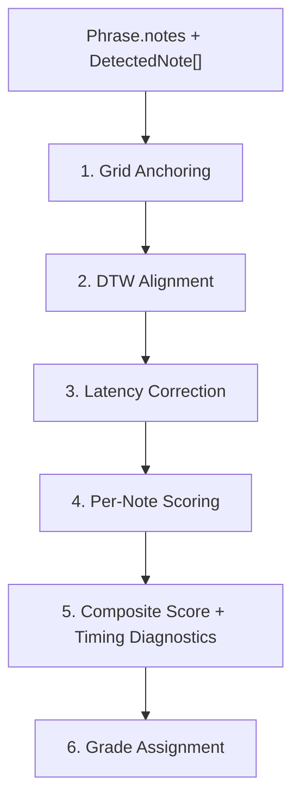

# Scoring Algorithm

The scoring engine takes expected notes (from a `Phrase`) and detected notes (from the microphone pipeline) and produces a `Score` with per-note pitch and rhythm accuracy, plus timing diagnostics.

**Source files:** `src/lib/scoring/`

- `score-pipeline.ts` — thin orchestrator that combines bleed filtering and scoring (used by the live path, post-hoc rescore, and the diagnostics replay panel)
- `scorer.ts` — `scoreAttempt()` — DTW + latency correction + per-note scoring
- `alignment.ts` — DTW alignment
- `pitch-scoring.ts` / `rhythm-scoring.ts` — per-note scorers
- `grades.ts` — grade thresholds, labels, captions, colors

## Pipeline



`runScorePipeline()` wraps `scoreAttempt()` with an optional bleed-filter stage. Callers pre-segment their audio into `DetectedNote[]` and optionally pass a `BleedFilterResult` with `{ kept, filtered }`. The pipeline always computes the unfiltered score; when a bleed result is provided, it also computes the filtered score and returns a diagnostic `BleedFilterLog`. A `bleedFilterEnabled` flag controls which score is marked `chosen`; both scores are always returned so the caller can log or display either.

## 0. Onset Time Compensation (Practice Page)

Before notes reach the scoring pipeline, the practice page's `extractOnsetsFromReadings()` detects note onsets from pitch readings. When a gap > 100ms is detected (indicating silence, e.g., a breath between bars), the onset is **back-dated by 50ms** (`ATTACK_LATENCY`) to compensate for the pitch detector's re-lock delay.

**Why:** After silence, the AnalyserNode buffer clears and the pitch detector needs several frames to rebuild clarity above the 0.80 threshold. This introduces a systematic delay on the first note after any breath, which disproportionately penalizes bar-boundary notes. The compensation corrects this at the source.

```
if (gap > GAP_THRESHOLD):
    onset = reading.time - ATTACK_LATENCY  // 50ms back-date
else if (noteChanged):
    onset = reading.time                    // no compensation needed
```

The record and lick-practice paths use the AudioWorklet onset detector (HFC + EMA, threshold 3.0) instead, which produces onsets directly and does not need this compensation.

## 1. Grid Anchoring (`scorer.ts:anchorToGrid`)

Detected notes have `onsetTime` relative to when the pitch detector started. To compare against expected notes (which have offsets relative to the phrase start), detected notes must be anchored to the Transport's beat grid.

The algorithm snaps detected onsets to the nearest bar downbeat:

```
barDuration = beatsPerBar * (60 / tempo)
barStart = round(transportSeconds / barDuration) * barDuration
recordingOffset = transportSeconds - barStart
adjustedOnset = detectedOnset + recordingOffset
```

## 2. DTW Alignment (`alignment.ts`)

**Dynamic Time Warping** finds the minimum-cost alignment between two sequences of different lengths. This handles:

- **Extra notes** the user played that aren't in the phrase
- **Missed notes** the user didn't play
- **Timing variations** — notes played slightly out of order or at different times

### Cost Function

Each cell in the cost matrix considers three options:

1. **Match**: `pitchDistance + rhythmDistance` (match expected[i] with detected[j])
2. **Skip expected**: cost = 2.0 (missed note)
3. **Skip detected**: cost = 2.0 (extra note)

**Pitch distance:**

- Same MIDI note → 0.0 (or same pitch class in any octave, when `octaveInsensitive` is true)
- 1 semitone off → 0.5
- 2+ semitones off → 1.0 (capped)

**Rhythm distance:**

- `|expectedOnset - detectedOnset| / beatDuration`
- Capped at 1.0

### Octave-insensitive matching

When `octaveInsensitive` is true, pitch distance uses `midiToPitchClass()` on both sides so a lick played an octave up or down still matches. This is enabled for lick-practice continuous mode, where the user may legitimately transpose a lick to keep it on the horn. Ear-training and call-response stay strict.

### Backtracking

After filling the cost matrix, backtracking from `dp[N][M]` to `dp[0][0]` produces `AlignmentPair[]`. Each pair indicates:

- `expectedIndex + detectedIndex` → matched pair
- `expectedIndex + null` → missed note
- `null + detectedIndex` → extra note

## 3. Latency Correction (`scorer.ts`)

Human latency (reaction time + detection delay) creates a constant offset between expected and detected onsets. The scorer computes the **median timing offset** of all matched pairs and subtracts it from all detected onsets.

```typescript
offsets = matchedPairs.map(pair => detected[j].onset - expected[i].onset)
correction = median(offsets)
correctedOnset = detectedOnset - correction
```

Median (not mean) is used so a single outlier (e.g., a dropped first note) does not skew the correction. The raw correction is returned in the `timing.latencyCorrectionMs` diagnostic field.

## 4. Per-Note Pitch Scoring (`pitch-scoring.ts`)

```text
if wrong MIDI note (or pitch class, in octaveInsensitive mode) → 0.0
if correct note                                                → 1.0 + intonation bonus
  intonation bonus = 0.1 * max(0, 1 - |cents| / 50)
```

- Perfect intonation (0 cents): 1.10
- 25 cents off: 1.05
- 50 cents off: 1.00
- Wrong note: 0.00
- Rests: 1.0 automatically

The bonus is clamped to 1.0 at the composite level — it only tips ties on otherwise correct notes.

## 5. Per-Note Rhythm Scoring (`rhythm-scoring.ts`)

```text
timingError = |detectedOnset - expectedOnset| / beatDuration
penalty     = min(1.0, 0.5 + tempo / 300)
rhythmScore = max(0, 1.0 - timingError * penalty)
```

**Tempo-scaled penalty.** The penalty ramps from gentle at slow tempos to strict at fast tempos:

- 60 BPM → penalty 0.70, score hits 0 at ~1.43 beats off (≈1430 ms)
- 100 BPM → penalty 0.83, score hits 0 at ~1.20 beats off (≈720 ms)
- 200 BPM → penalty 1.00, score hits 0 at 1 beat off (300 ms)

At slow tempos beats are long, so the same absolute timing error is a smaller fraction of a beat — a gentler curve feels fair. At fast tempos the beats are short, so the same fraction-of-a-beat represents a tighter absolute window, and a steeper penalty is reasonable.

Rests score 1.0 automatically.

**Swing-aware scoring.** When `swing > 0.5` and the expected note falls on an off-beat eighth note (the "&" of a beat), the expected onset is shifted to match Tone.js swing playback: `expectedOnset += (swing - 0.5) * beatDuration`. This prevents swing timing from being penalized as rhythmically inaccurate.

## 6. Composite Score + Timing Diagnostics

```text
pitchAccuracy  = average(pitchScores)    // across scored notes
rhythmAccuracy = average(rhythmScores)   // across scored notes
overall        = pitchAccuracy * 0.6 + rhythmAccuracy * 0.4
```

Pitch is weighted more heavily (60%) because getting the right notes is harder than getting the rhythm exactly right.

In addition to the accuracy numbers, `Score.timing: TimingDiagnostics` is returned:

| Field                 | Meaning                                                                       |
| --------------------- | ----------------------------------------------------------------------------- |
| `meanOffsetMs`        | Mean signed offset across matched pairs (positive = late, negative = early)   |
| `medianOffsetMs`      | Median signed offset                                                          |
| `stdDevMs`            | Standard deviation — a proxy for timing jitter                                |
| `latencyCorrectionMs` | The constant offset subtracted in step 3                                      |
| `perNoteOffsetMs`     | `(number \| null)[]` aligned with `noteResults`, `null` for missed/extra      |

These diagnostics drive the replay panel in `/diagnostics` and the timing visualization in session reports.

## 7. Grade Assignment (`grades.ts`)

| Grade       | Threshold | Label        | Color                          | Caption                           |
| ----------- | --------- | ------------ | ------------------------------ | --------------------------------- |
| `perfect`   | ≥ 95%     | "Perfect"    | `var(--color-success)`         | "Right in the pocket."            |
| `great`     | ≥ 85%     | "Great"      | `var(--color-success)`         | "Cookin'."                        |
| `good`      | ≥ 70%     | "Good"       | `var(--color-accent)`          | "Swinging along."                 |
| `fair`      | ≥ 55%     | "Fair"       | `var(--color-warning)`         | "A little off the changes."       |
| `try-again` | < 55%     | "Try Again"  | `var(--color-error)`           | "Take it again from the top."     |

`GRADE_CAPTIONS` are liner-note-style one-liners shown below the grade label in session reports — a small warmth touch consistent with the Blue Note visual identity.

Because `--color-accent` is domain-scoped, the "Good" grade reads peacock-teal in ear-training and terracotta in lick-practice — it always takes the current domain's accent, not a hard-coded hue.

## Bleed filter integration

When the backing track is audible in the user's mic (bleed), spurious notes can be detected. `bleed-filter.ts` runs *before* scoring and classifies each detected note as `kept` or `filtered` based on:

- Proximity to a known backing-track event
- Pitch class match with an active chord tone
- Amplitude/confidence heuristics

`runScorePipeline()` always computes the unfiltered score and, when a bleed result is present, also computes the filtered score and a `BleedFilterLog`. The `bleedFilterEnabled` flag decides which one is `chosen`. Both are kept so the `/diagnostics` replay UI can show the A/B.

## Example

Given a 4-note phrase at 120 BPM (beat = 0.5s, penalty = 0.90):

| Expected     | Detected               | Pitch Score | Rhythm Score |
| ------------ | ---------------------- | ----------- | ------------ |
| C4 at beat 0 | C4 at 0.01s (10ms late)  | 1.0         | ≈ 0.98       |
| E4 at beat 1 | E4 at 0.52s             | 1.0         | ≈ 0.96       |
| G4 at beat 2 | Ab4 at 1.0s             | 0.0         | 1.0          |
| C5 at beat 3 | *(missed)*              | 0.0         | 0.0          |

- pitchAccuracy = (1 + 1 + 0 + 0) / 4 = 0.50
- rhythmAccuracy ≈ (0.98 + 0.96 + 1.0 + 0) / 4 ≈ 0.73
- overall ≈ 0.50 × 0.6 + 0.73 × 0.4 ≈ 0.59
- grade = "fair"
